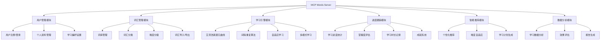
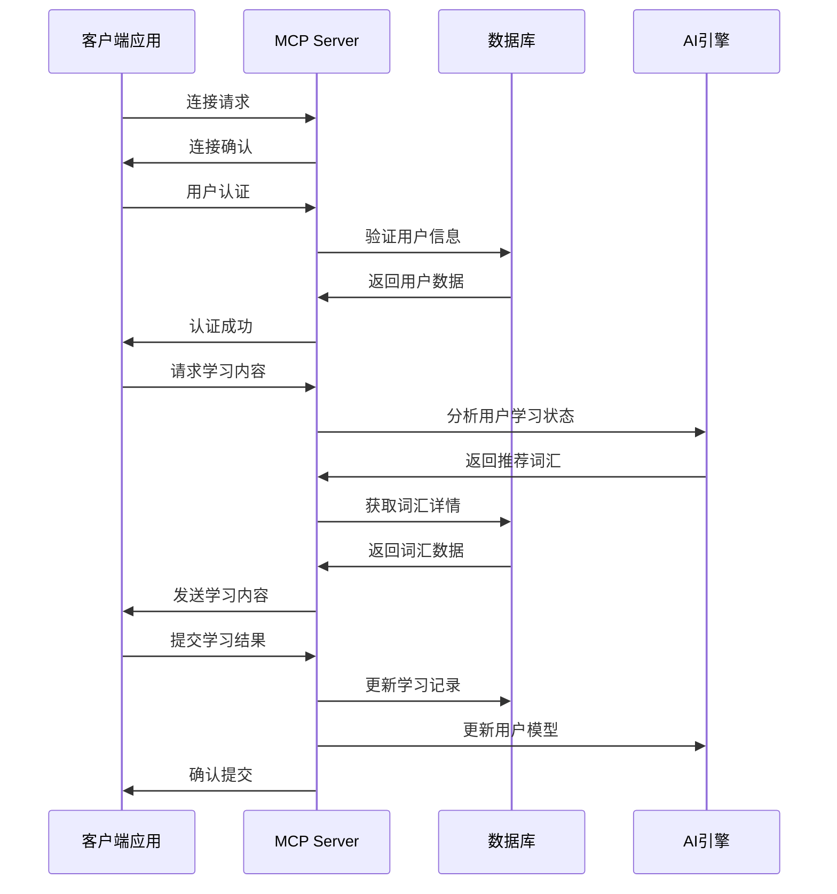
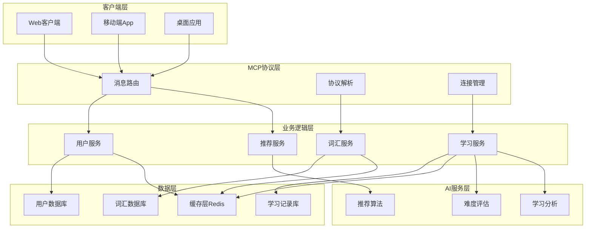
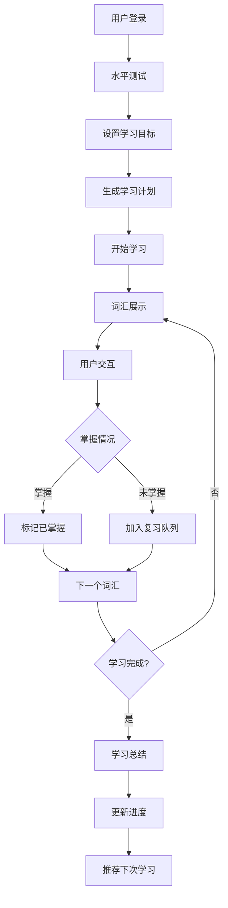
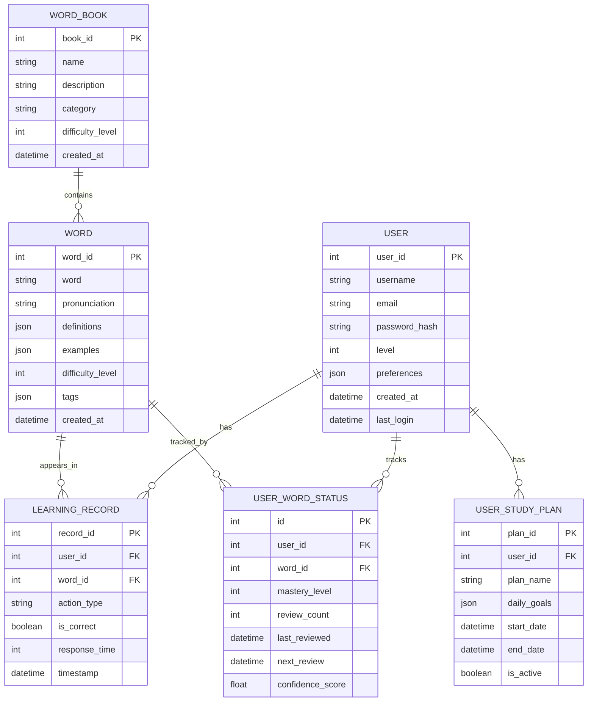

# MCP 背单词服务器产品需求文档 (PRD)

## 1. 产品概述

### 1.1 产品名称

MCP Words Learning Server - 基于消息控制协议的智能背单词平台

### 1.2 产品定位

一个高效、智能且个性化的英语词汇学习平台，通过MCP（Message Control Protocol）协议为学生提供科学的背单词解决方案。

### 1.3 目标用户

- 英语学习者（初级到高级）
- 备考学生（四六级、托福、雅思、GRE等）
- 英语教师和培训机构
- 自主学习的成人学习者

## 2. 产品目标

### 2.1 核心目标

- 提高用户英语词汇量掌握效率
- 通过科学的记忆算法减少遗忘率
- 提供个性化的学习路径和进度跟踪
- 构建可扩展的MCP服务器架构

### 2.2 业务目标

- 用户日活跃度达到80%以上
- 单词记忆效率提升50%
- 用户学习完成率达到70%以上

## 3. 功能需求

### 用户答题记录系统
1. **独立文件存储**
   - 每次答题生成独立的JSON文件，命名格式：`quiz_YYYYMMDD_HHMMSS.json`
   - 文件内容包含：
     - 答题时间戳
     - 答题总数/正确数/错误数
     - 正确率/平均用时
     - 最快/最慢答题时间
     - 薄弱知识点分析

2. **历史记录查询**
   - 支持查找最近N次答题记录
   - 可按日期范围筛选记录

3. **可视化分析**
   - 与可视化插件集成，生成答题曲线图
   - 支持展示正确率趋势、用时变化等指标

4. **单项统计查询**
   - 支持返回最后N次的特定统计指标
   - 参数配置：
     - 统计周期：可按天/周/月或指定次数范围
     - 统计指标：支持正确率/平均用时/错误数等
   - 返回格式示例：
     ```json
     {
       "period": "last_7_days",
       "metric": "accuracy",
       "values": [85, 82, 90, 88, 86, 91, 89]
     }
     ```
   - 支持返回最近N天每日测试次数
   - 参数配置：
     - days: 查询天数范围
   - 返回格式示例：
     ```json
     {
       "period": "last_7_days",
       "metric": "test_counts",
       "values": [3, 5, 2, 4, 6, 3, 5]
     }
     ```

### 3.1 核心功能模块



### 3.2 MCP协议架构



### 3.3 详细功能说明

#### (optional)3.3.1 用户管理模块

- **用户注册/登录**: 支持邮箱、手机号注册，第三方登录
- **个人资料管理**: 学习目标设置、英语水平评估
- **学习偏好设置**: 每日学习时长、提醒设置、学习模式选择

#### 3.3.2 词汇管理模块

- **词库管理**: 支持多种词库（四六级、托福、雅思、GRE等）
- **词汇分类**: 按主题、难度、词性分类
- **难度分级**: 基于用户水平的动态难度调整
- **词汇导入/导出**: 支持自定义词库导入

为了实现同词根的扩展学习和同义词扩展学习，需要添加表来记录
- 词根表

- 按词根分类单词并标注词源
- 包含词根含义和衍生词示例
- 同义词表

- 按核心含义分组单词
- 标注词性差异和使用场景
- 包含近义词强度对比


#### 3.3.3 学习引擎模块

- **艾宾浩斯遗忘曲线**: 
  - 基于遗忘曲线自动计算最佳复习时间点
  - 记忆强度衰减模型预测遗忘概率
  - 动态调整复习间隔(1天/3天/7天/15天等)
  - **算法实现**:
    - 遗忘率公式: R = e^(-t/S)
      - R: 记忆保留率(0-1)
      - t: 时间间隔(小时)
      - S: 记忆稳定性参数(初始值20)
    - 复习间隔计算:
      - 首次复习: 1天后(R≈44%)
      - 第二次: 3天后(R≈36%)
      - 第三次: 7天后(R≈30%)
      - 后续间隔: 前次间隔×2.5
    - 自适应调整:
      - 正确回答: S = S×1.5
      - 错误回答: S = S×0.5
  - **示例**:
    - 学习单词"apple"后:
      - 初始S=20
      - 1天后复习(正确)→S=30
      - 下次复习间隔:3×2.5=7.5天(取整7天)
      - 7天后复习(错误)→S=15
      - 下次复习间隔:7×0.5=3.5天(取整3天)

- **间隔重复算法**: 
  - 采用SuperMemo2算法核心逻辑
  - **核心公式**:
    - EF' = EF + (0.1 - (5-q) * (0.08 + (5-q) * 0.02))
      - EF: 易度因子(初始2.5)
      - q: 答题质量(0-5)
    - I(n) = I(n-1) * EF
      - I: 复习间隔(天)
      - n: 复习次数
  - **参数说明**:
    - 答题质量q:
      - 5: 完美回忆
      - 4: 犹豫但正确
      - 3: 困难但正确
      - 2: 错误但记得
      - 1: 完全遗忘
    - 遗忘阈值: EF<1.3时触发重新学习
  - **示例**:
    - 学习单词"banana":
      - 初始EF=2.5, I(1)=1天
      - 第1次复习: q=4(犹豫但正确)
        - EF'=2.5+(0.1-(5-4)*(0.08+(5-4)*0.02))=2.5-0.1=2.4
        - I(2)=1*2.4≈2天
      - 第2次复习: q=5(完美回忆)
        - EF'=2.4+(0.1-(5-5)*(...))=2.4+0.1=2.5
        - I(3)=2*2.5=5天
      - 第3次复习: q=2(错误但记得)
        - EF'=2.5+(0.1-(5-2)*(...))=2.5-0.34=2.16
        - I(4)=5*2.16≈11天
      - 第4次复习: q=1(完全遗忘)
        - EF'=2.16-0.54=1.62
        - EF<1.3 → 触发重新学习
        - 重置I=1天, EF=2.0

- **自适应学习**:
  - **掌握程度计算**:
    - 掌握度 = (正确次数 / 总测试次数) * 100%
    - 加权计算: 近期测试结果权重更高
  - **错误模式分析**:
    - 错误类型检测:
      - 拼写错误(字母顺序/遗漏)
      - 词义混淆(同义词/反义词)
      - 用法错误(词性/搭配)
    - 错误模式统计:
      - 各类型错误占比
      - 错误频率趋势
  - **学习策略调整**:
    - 难度级别:
      - 掌握度<30%: 基础模式(选择题)
      - 30-70%: 进阶模式(填空题)
      - >70%: 挑战模式(造句/翻译)
    - 学习重点:
      - 高频错误类型优先练习
      - 薄弱知识点强化训练
  - **个性化推荐**:
    - 基于用户历史数据推荐:
      - 相似难度单词
      - 相关词根/词缀单词
      - 同主题词汇
  - **示例**:
    - 用户学习单词"accelerate":
      - 测试记录:
        - 第1次: 拼写错误(acelerate)
        - 第2次: 词义混淆(误选speed up)
        - 第3次: 正确
      - 分析结果:
        - 掌握度: 33%
        - 主要错误: 拼写(50%)+词义(50%)
      - 系统调整:
        - 难度: 基础模式(选择题)
        - 重点: 拼写练习+词义辨析
        - 推荐: "decelerate"(反义词)练习

- **多模式学习**:
  - **拼写测试**:
    - 算法实现:
      - 听写: 语音识别+模糊匹配(85%相似度阈值)
      - 拼写检查: 编辑距离算法(Levenshtein距离)
      - 自动纠错: 基于概率的语言模型
    - 示例: 单词"necessary"
      - 用户输入: "neccessary"
      - 系统检测: 编辑距离=1
      - 建议纠正: "necessary"

  - **选择题**:
    - 算法实现:
      - 选项生成: 同义词/反义词/随机干扰项
      - 图片联想: 图像特征向量匹配
      - 难度控制: 基于单词掌握度
    - 示例: 单词"abundant"
      - 正确选项: plentiful
      - 干扰项: scarce, moderate, elegant

  - **听力训练**:
    - 算法实现:
      - 发音评估: MFCC特征比对
      - 听写填空: 关键词提取+部分掩码
    - 示例: 句子"The cat sat on the mat"
      - 填空: "The ___ sat on the ___"
      - 正确答案: cat, mat

  - **造句练习**:
    - 算法实现:
      - 语法检查: 依存句法分析
      - 句式建议: 模板匹配+替换
    - 示例: 单词"persuade"
      - 用户造句: "He persuade me go"
      - 纠正建议: "He persuaded me to go"

  - **词义匹配**:
    - 算法实现:
      - 中英互译: 双语词向量对齐
      - 近义词区分: 词义消歧+上下文分析
    - 示例: 单词"bank"
      - 正确匹配: 银行(金融)/河岸(地理)
      - 近义词区分: shore(自然)/coast(地理)

- **数据统计**:
  - **学习进度可视化**:
    - 日历热力图算法:
      - 颜色梯度: 0-30分钟(浅色), 30-60分钟(中等), 60+分钟(深色)
      - 交互功能: 点击查看当日详情
    - 示例:
      - 用户A: 连续7天学习(30,45,60,20,50,70,40分钟)
      - 热力图显示: 形成完整学习链

  - **记忆保持率曲线**:
    - 算法实现:
      - 遗忘曲线拟合: 使用艾宾浩斯公式
      - 实际记忆率: 基于测试结果计算
    - 示例:
      - 单词"phenomenon":
        - 第1天: 100%
        - 第3天: 58%
        - 第7天: 35%
        - 第30天: 22%

  - **薄弱环节分析**:
    - 分析维度:
      - 词性维度(名词/动词/形容词)
      - 主题维度(科技/生活/商务)
      - 错误类型(拼写/词义/用法)
    - 示例报告:
      - 薄弱点: 科技类动词(正确率62%)
      - 建议: 加强"develop, implement, optimize"等词汇

  - **每日学习统计**:
    - 统计指标:
      - 学习时长: 总时长/有效时长
      - 学习效率: 单词数/分钟
      - 专注度: 连续学习时段
    - 示例数据:
      - 日期: 2023-11-15
      - 总时长: 45分钟
      - 学习单词: 30个
      - 专注时段: 10:00-10:25(25分钟)

#### 3.3.4 进度跟踪模块

- **学习进度统计**:
  - 实现方式:
    - 按单元/主题统计完成百分比
    - 可视化进度条和完成度图表
    - 预测完成时间算法
  - 示例:
    - 用户A: 已完成科技类词汇60%(120/200)
    - 预测剩余时间: 8天(每天10词)

- **掌握度评估**:
  - 评估维度:
    - 记忆强度(0-5分)
    - 反应速度(毫秒级)
    - 应用能力(造句/翻译)
  - 示例报告:
    - 单词"algorithm":
      - 记忆强度: 4/5
      - 反应速度: 1.2秒
      - 应用能力: 能造句但翻译不准确

- **学习时长记录**:
  - 记录内容:
    - 每日/每周/每月学习时长
    - 各学习模式时间分布
    - 专注时段分析
  - 示例数据:
    - 本周: 总时长5小时
    - 模式分布: 拼写(40%)/选择(30%)/听力(30%)
    - 最佳专注时段: 9:00-11:00

- **成就系统**:
  - 里程碑设计:
    - 连续学习天数(7/30/100天)
    - 词汇量突破(1000/5000/10000词)
    - 专项成就(科技达人/商务精英)
  - 奖励机制:
    - 虚拟徽章和称号
    - 学习资源解锁
    - 进度加速道具
  - 示例成就:
    - "七日学霸": 连续7天每天学习≥30分钟
    - "科技先锋": 掌握500个科技词汇

## 4. 技术架构

### 4.1 系统架构图



### 4.2 技术栈选择

- **后端**: Node.js/Python + Express/FastAPI
- **数据库**: PostgreSQL + Redis
- **MCP协议**: 基于WebSocket的自定义协议实现
- **AI/ML**: TensorFlow/PyTorch用于推荐算法
- **部署**: Docker + Kubernetes

### 4.3 MCP接口设计

#### 4.3.1 Tools接口

- 提供核心功能调用
- 标准化请求/响应格式

#### 4.3.2 Resources接口

- 管理静态资源(词库、音频、图片)
- 支持资源上传/下载
- 资源版本控制

##### 词库管理详细说明

###### 个性化词库生成

1. **兴趣标签收集**
   
   - 通过用户注册问卷收集初始兴趣标签
   - 根据学习行为动态调整兴趣权重
   - 示例兴趣标签：
     
     ```
     ["科技", "旅游", "商业", "文学", "历史"]
     ```

2. **智能词库生成**
   
   - 根据兴趣标签自动筛选匹配词汇
   - 支持自定义难度和数量
   - 示例请求：
     
     ```
     POST /resources/personalized-vocabulary
     {
       "user_id": "123",
       "interests": ["科技", "商业"],
       "level": "B2",
       "word_count": 50
     }
     ```

3. **动态调整机制**
   
   - 根据用户学习表现优化词库
   - 自动补充相关领域词汇
   - 示例调整策略：
     
     ```
     {
       "difficulty_adjustment": "+0.5",
       "related_topics": ["人工智能", "金融科技"]
     }
     ```

4. **词库上传**
   
   - 支持CSV/JSON格式的词库文件
   - 可指定词库名称、分类和难度等级
   - 示例请求：
     
     ```
     POST /resources/vocabulary
     {
       "name": "CET4词汇",
       "category": "考试词汇",
       "level": "B1",
       "file": "cet4_words.csv"
     }
     ```

5. **词库下载**
   
   - 按ID或名称获取词库
   - 支持按分类/难度筛选
   - 示例请求：
     
     ```
     GET /resources/vocabulary?category=考试词汇
     ```

6. **版本控制**
   
   - 每个词库维护多个版本
   - 可回滚到历史版本
   - 示例请求：
     
     ```
     GET /resources/vocabulary/{id}/versions
     ```

7. **词库更新**
   
   - 增量更新词库内容
   - 支持合并/覆盖模式
   - 示例请求：
     
     ```
     PATCH /resources/vocabulary/{id}
     {
       "action": "merge",
       "file": "cet4_updates.json"
     }
     ```

8. **词库删除**
   
   - 软删除保留历史记录
   - 示例请求：
     
     ```
     DELETE /resources/vocabulary/{id}
     ```

#### 4.3.3 Prompts接口

- 处理AI交互提示词
- 支持多语言提示模板
- 动态提示词生成

## 5. 用户体验设计

### 5.1 学习流程设计



### 5.2 界面设计原则

- **简洁直观**: 减少认知负担，专注学习内容
- **个性化**: 根据用户偏好调整界面风格
- **响应式**: 支持多设备适配
- **无障碍**: 支持视觉、听觉辅助功能

## 6. 数据模型设计

### 6.1 核心数据实体



## 7. 性能要求

### 7.1 响应时间要求

- 用户登录: < 2秒
- 词汇加载: < 1秒
- 学习记录提交: < 500ms
- 推荐算法响应: < 3秒

### 7.2 并发要求

- 支持1000+并发用户
- 峰值QPS: 5000+
- 数据库连接池: 100+连接

### 7.3 可用性要求

- 系统可用性: 99.9%
- 数据备份: 每日自动备份
- 故障恢复时间: < 30分钟

## 8. 安全要求

### 8.1 数据安全

- 用户密码加密存储
- 敏感数据传输加密
- 定期安全审计

### 8.2 访问控制

- 基于角色的权限管理
- API访问频率限制
- 异常访问监控

## 9. 运营策略

### 9.1 用户增长策略

- 免费试用期
- 推荐奖励机制
- 社交分享功能
- 学习社区建设

### 9.2 用户留存策略

- 个性化学习体验
- 成就系统和排行榜
- 学习提醒和习惯养成
- 定期内容更新

## 10. 项目里程碑

### 10.1 开发阶段

- **阶段1** (4周): MCP协议框架和基础架构
- **阶段2** (6周): 核心功能模块开发
- **阶段3** (4周): AI推荐算法集成
- **阶段4** (3周): 用户界面和体验优化
- **阶段5** (2周): 测试和部署

### 10.2 发布计划

- **Alpha版本**: 内部测试，核心功能验证
- **Beta版本**: 小规模用户测试，功能完善
- **正式版本**: 公开发布，全功能上线

## 11. 风险评估

### 11.1 技术风险

- MCP协议实现复杂度
- AI算法效果不达预期
- 高并发性能瓶颈

### 11.2 业务风险

- 用户接受度不高
- 竞品冲击
- 内容版权问题

### 11.3 风险应对

- 技术预研和原型验证
- 用户调研和反馈收集
- 法律合规审查

## 12. 成功指标

### 12.1 产品指标

- 用户注册量
- 日活跃用户数
- 用户留存率
- 学习完成率

### 12.2 业务指标

- 用户满意度评分
- 词汇掌握效率提升
- 平台使用时长
- 付费转化率

---

# 13 扩充词库


. 数据结构设计：
词库数据：每个单词在词库中包含以下信息：

单词（Word）：例如“beautiful”

词性（Part of Speech）：例如“形容词（adjective）”

词义（Meaning）：例如“令人愉快或赏心悦目的”

例句（Example Sentence）：例如“Her beautiful smile made everyone feel happy.”

上下文信息（Contextual Information）：例如该单词在不同场景下的用法（如正式、口语、文学等）


使用词库


添加单词：


在 Claude Desktop 中输入：

添加单词 "serendipity"，定义为“意外发现美好事物的能力”，例句为“I found this book by serendipity in a small bookstore.”


Claude 会通过 MCP 服务器将单词保存到本地文件（vocabulary.json）。


查询单词：


输入：

告诉我“serendipity”的定义和例句。


Claude 会返回保存的定义和例句。


复习单词：


输入：

列出我所有的单词，带定义和例句。


Claude 会显示所有保存的单词，供您复习。


从来源提取单词：


输入：

从这篇文章提取生词：（粘贴文章内容或网页链接）


Claude 会分析文本，提取不熟悉的单词并添加到词库。

步骤 7：复习与管理


本地存储：


所有单词保存在 C:\Vocabulary\vocabulary.json（或 macOS 对应路径）。

注意事项


保持服务器运行：每次使用词库时，需先运行 python vocabulary_mcp_server.py。


数据安全：词库存储在本地，无需上传到云端，保护您的隐私。


扩展功能：如果需要更多功能（如发音或图片支持），可联系社区获取更高级的 MCP 服务器脚本。

## ds的使用方法建议

安装应用

提供一键安装包（Windows/macOS/Android/iOS），打开即用。

添加单词（自然语言示例）

基础模式（填空式命令）：

text
添加单词: resilient 
释义: 快速恢复的能力 
例句: Children are often remarkably resilient. 
标签: 心理学, 积极词汇
自由模式（口语化输入）：

"我要保存单词：resilient，意思是能快速恢复的，比如Children are resilient，标签是心理学"

### 用户使用模式

#### 1. 浏览模式
- **功能特点**:
  - 自由查看单词库内容
  - 支持按标签/主题/难度筛选
  - 提供单词详情展示(释义/例句/发音)
- **适用场景**:
  - 初次接触新词汇
  - 快速查阅单词信息
  - 非测试环境下的学习

#### 2. 考试模式
- **功能特点**:
  - 限时答题
  - 多种题型(选择/拼写/听力)
  - 自动评分和错题记录
- **适用场景**:
  - 检验学习成果
  - 模拟真实考试环境
  - 评估词汇掌握程度

#### 3. 复习模式
- **功能特点**:
  - 基于遗忘曲线的复习计划
  - 重点复习错题和薄弱项
  - 可调节复习强度和频率
- **适用场景**:
  - 巩固已学内容
  - 针对性强化记忆
  - 考前系统复习

管理词库
查单词：

输入："展示所有标签为‘高频’的单词"
系统返回列表：ubiquitous, pragmatic, empirical...
删单词：

输入："删除单词：obsolete"
智能复习
每日自动推送复习列表（基于艾宾浩斯遗忘曲线）。

用户反馈：

系统问："单词‘delegate’[委托] 的释义是？"
用户答："委托" → 系统标记为“已掌握”
导入/导出
导入外部词库：
输入："从Excel导入：我的单词表.xlsx"
导出为Anki：
输入："导出词库到Anki"

#### ds设想使用方法

> 用户：添加单词：mitigate，意思是减轻，例句The medicine mitigates pain，标签医学  
> 系统：已保存！mitigate [减轻]  
> 用户：明天提醒我复习  
> 系统：已加入明日复习计划（共5词）


## chatgpt的使用方法
语义层解析

举个例子：

用户输入：“Apple 是一个水果，通常是红色或绿色的，味道酸甜可口。”

系统存储：将“Apple”作为单词，并将其定义为“水果”以及描述其颜色、味道等特点的上下文信息。

后续复习：系统会定期提示用户复习“Apple”这个单词及其语境，帮助他们记忆并加深印象。


C. 系统架构建议
前端：用户通过手机App或网页端与系统交互。设计界面简洁直观，支持文本和语音输入。

使用React、Vue等框架开发一个轻量级的Web应用，或者开发移动端App（如React Native、Flutter）。

后端：用于存储用户词库、学习进度以及提供智能复习推荐等功能。

使用Flask/Django等Python后端框架构建API来支持前端请求。

数据存储可以使用SQLite或更简单的本地文件管理，避免涉及复杂的数据库操作。

自然语言处理模块：

可以使用现成的自然语言处理库（如spaCy、NLTK）来解析用户的输入，并提取其中的关键词和语境。

如果你需要识别语音输入，可以集成Google Speech-to-Text等API进行语音转文本处理。

复习算法：实现基于间隔重复的算法（SRS），如Anki的算法。

系统根据用户复习情况来决定何时提示复习特定单词。


## 数据装填

MCP（Message Context Protocol）将用于定义单词的结构化存储方式。每个单词将被表示为一个MCP消息，包含以下字段：

主题（Subject）： 单词本身（如"happy"）。
内容（Content）： 单词的详细描述，包括：
发音（Pronunciation）： 单词的发音方式（如"/ˈhæpi/"）。
释义（Definition）： 单词的中文释义（如"快乐的，幸福的"）。
例句（Example）： 包含该单词的例句（如"I am very happy today."）。
标签（Tags）： 用户自定义的标签（如"情感词汇"、"日常用语"）。
难度级别（Difficulty Level）： 单词的难度等级（如"初级"、"中级"、"高级"）。
学习状态（Learning Status）： 单词的学习状态（如"已掌握"、"需要复习"）。


## 卖点
用户优势
零学习成本：用“说话”的方式管理词库（如“给单词加个标签‘考试重点’”）。

全自动复习：系统智能安排复习时间，避免手动规划。

永久本地存储：数据存于用户设备，无需担心隐私泄露。

交付物：提供可直接安装的桌面/手机应用，内含教程视频（3分钟上手）。用户只需输入自然语言命令，所有技术细节由系统自动处理。

## 记忆方法

联想记忆法：通过将新单词与已知的概念、图像或故事联系起来，帮助记忆。例如，单词 “apple” 可以联想到 “红苹果掉在头上” 的故事。
词根词缀法：学习常见的词根、前缀和后缀，可以帮助你理解和记忆更多相关单词。例如，“bio-” 意为生命，“logy” 意为学科，那么 “biology” 就是生物学。
分类记忆法：将单词按照主题或类别分组记忆，如动物、植物、食物等。
重复记忆法：通过不断重复和复习来巩固记忆。可以使用闪卡、应用程序或写下单词来帮助记忆。
使用记忆宫殿：将单词与熟悉的空间位置联系起来，形成一个记忆路径。
听写练习：通过听写单词来加强记忆，同时也能提高拼写能力。
阅读和听力练习：在阅读文章或听音频材料时，遇到新单词时尝试猜测其意义，然后查字典确认。
使用单词卡片：将单词写在卡片的一面，定义或例句写在另一面，随时随地拿出来复习。
故事法：尝试用新学的单词编写小故事，这样可以在语境中记忆单词。
间隔重复：使用间隔重复的学习方法，如Anki等应用程序，这些工具会根据你的记忆情况安排复习时间。
记住，每个人的学习方式都不同，你可以尝试多种方法，找到最适合自己的记忆策略。同时，保持学习的兴趣和动力也是非常重要的。


## 我的联想
从youtube上直接趴字幕，然后将文中潜在的困难的词全部提取到我的词库


*本PRD文档将根据项目进展和用户反馈持续更新和完善。*