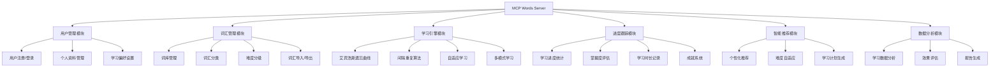
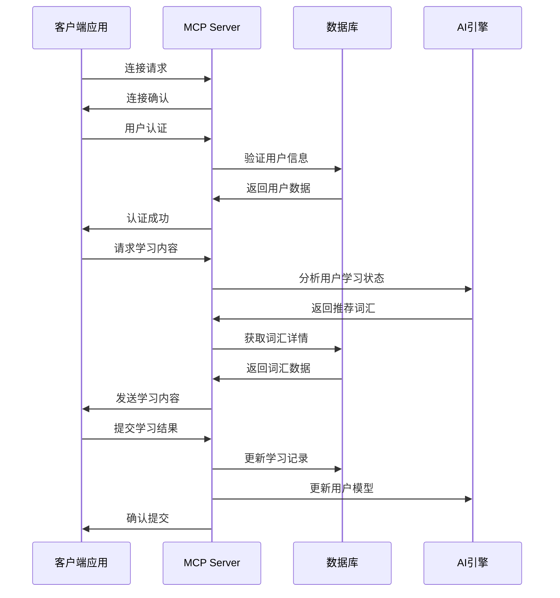
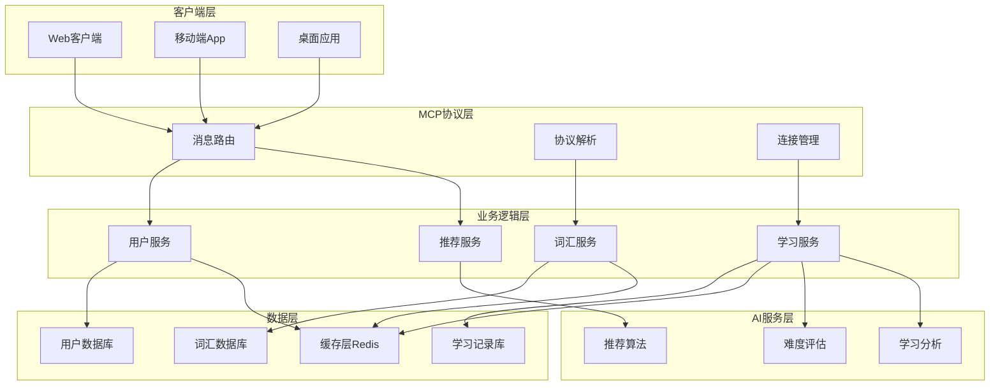
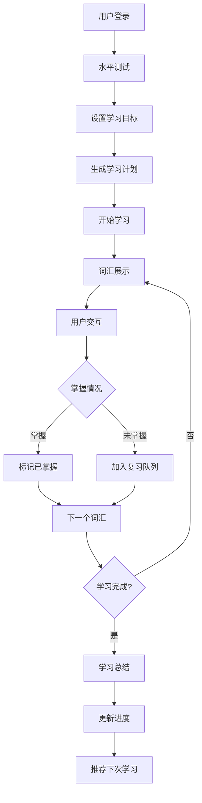
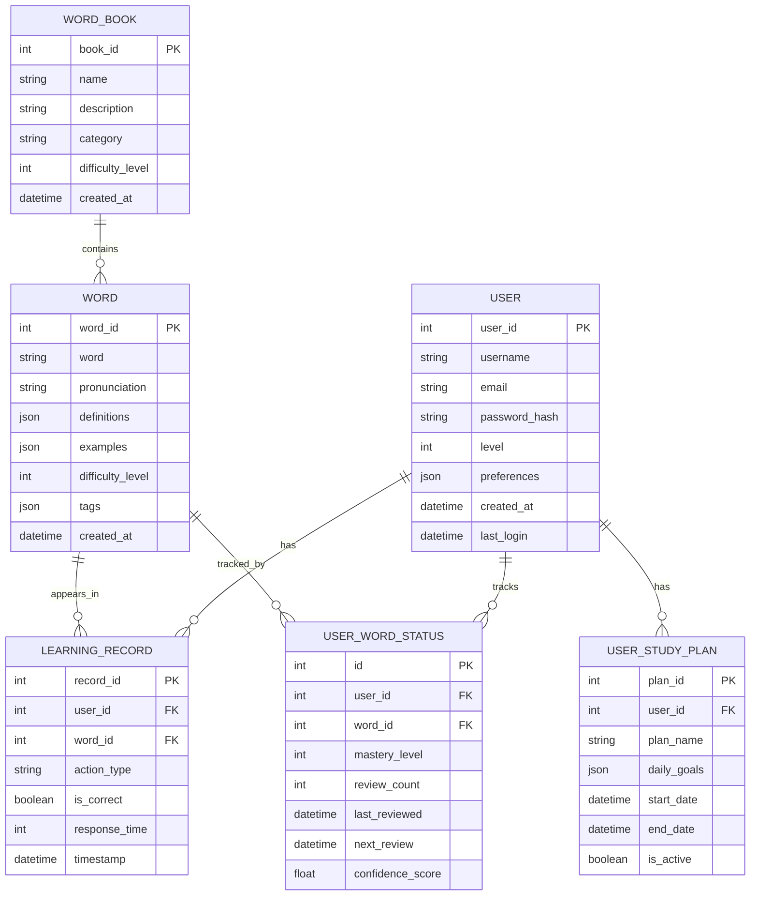

# MCP 背单词服务器产品需求文档 (PRD)

## 1. 产品概述

### 1.1 产品名称

MCP Words Learning Server - 基于消息控制协议的智能背单词平台

### 1.2 产品定位

一个高效、智能且个性化的英语词汇学习平台，通过MCP（Message Control Protocol）协议为学生提供科学的背单词解决方案。

### 1.3 目标用户

- 英语学习者（初级到高级）
- 备考学生（四六级、托福、雅思、GRE等）
- 英语教师和培训机构
- 自主学习的成人学习者

## 2. 产品目标

### 2.1 核心目标

- 提高用户英语词汇量掌握效率
- 通过科学的记忆算法减少遗忘率
- 提供个性化的学习路径和进度跟踪
- 构建可扩展的MCP服务器架构

### 2.2 业务目标

- 用户日活跃度达到80%以上
- 单词记忆效率提升50%
- 用户学习完成率达到70%以上

## 3. 功能需求

### 3.1 核心功能模块



### 3.2 MCP协议架构



### 3.3 详细功能说明

#### 3.3.1 用户管理模块

- **用户注册/登录**: 支持邮箱、手机号注册，第三方登录
- **个人资料管理**: 学习目标设置、英语水平评估
- **学习偏好设置**: 每日学习时长、提醒设置、学习模式选择

#### 3.3.2 词汇管理模块

- **词库管理**: 支持多种词库（四六级、托福、雅思、GRE等）
- **词汇分类**: 按主题、难度、词性分类
- **难度分级**: 基于用户水平的动态难度调整
- **词汇导入/导出**: 支持自定义词库导入

#### 3.3.3 学习引擎模块

- **艾宾浩斯遗忘曲线**: 基于遗忘规律的复习安排
- **间隔重复算法**: SuperMemo算法优化记忆效果
- **自适应学习**: 根据掌握情况调整学习策略
- **多模式学习**: 拼写、选择、听力、造句等多种模式

#### 3.3.4 进度跟踪模块

- **学习进度统计**: 实时跟踪学习进度和完成情况
- **掌握度评估**: 基于多维度评估词汇掌握程度
- **学习时长记录**: 详细记录学习时间分布
- **成就系统**: 学习里程碑和奖励机制

## 4. 技术架构

### 4.1 系统架构图



### 4.2 技术栈选择

- **后端**: Node.js/Python + Express/FastAPI
- **数据库**: PostgreSQL + Redis
- **MCP协议**: 基于WebSocket的自定义协议实现
- **AI/ML**: TensorFlow/PyTorch用于推荐算法
- **部署**: Docker + Kubernetes

### 4.3 MCP接口设计

#### 4.3.1 Tools接口

- 提供核心功能调用
- 标准化请求/响应格式

#### 4.3.2 Resources接口

- 管理静态资源(词库、音频、图片)
- 支持资源上传/下载
- 资源版本控制

##### 词库管理详细说明

###### 个性化词库生成

1. **兴趣标签收集**
   
   - 通过用户注册问卷收集初始兴趣标签
   - 根据学习行为动态调整兴趣权重
   - 示例兴趣标签：
     
     ```
     ["科技", "旅游", "商业", "文学", "历史"]
     ```

2. **智能词库生成**
   
   - 根据兴趣标签自动筛选匹配词汇
   - 支持自定义难度和数量
   - 示例请求：
     
     ```
     POST /resources/personalized-vocabulary
     {
       "user_id": "123",
       "interests": ["科技", "商业"],
       "level": "B2",
       "word_count": 50
     }
     ```

3. **动态调整机制**
   
   - 根据用户学习表现优化词库
   - 自动补充相关领域词汇
   - 示例调整策略：
     
     ```
     {
       "difficulty_adjustment": "+0.5",
       "related_topics": ["人工智能", "金融科技"]
     }
     ```

4. **词库上传**
   
   - 支持CSV/JSON格式的词库文件
   - 可指定词库名称、分类和难度等级
   - 示例请求：
     
     ```
     POST /resources/vocabulary
     {
       "name": "CET4词汇",
       "category": "考试词汇",
       "level": "B1",
       "file": "cet4_words.csv"
     }
     ```

5. **词库下载**
   
   - 按ID或名称获取词库
   - 支持按分类/难度筛选
   - 示例请求：
     
     ```
     GET /resources/vocabulary?category=考试词汇
     ```

6. **版本控制**
   
   - 每个词库维护多个版本
   - 可回滚到历史版本
   - 示例请求：
     
     ```
     GET /resources/vocabulary/{id}/versions
     ```

7. **词库更新**
   
   - 增量更新词库内容
   - 支持合并/覆盖模式
   - 示例请求：
     
     ```
     PATCH /resources/vocabulary/{id}
     {
       "action": "merge",
       "file": "cet4_updates.json"
     }
     ```

8. **词库删除**
   
   - 软删除保留历史记录
   - 示例请求：
     
     ```
     DELETE /resources/vocabulary/{id}
     ```

#### 4.3.3 Prompts接口

- 处理AI交互提示词
- 支持多语言提示模板
- 动态提示词生成

## 5. 用户体验设计

### 5.1 学习流程设计



### 5.2 界面设计原则

- **简洁直观**: 减少认知负担，专注学习内容
- **个性化**: 根据用户偏好调整界面风格
- **响应式**: 支持多设备适配
- **无障碍**: 支持视觉、听觉辅助功能

## 6. 数据模型设计

### 6.1 核心数据实体



## 7. 性能要求

### 7.1 响应时间要求

- 用户登录: < 2秒
- 词汇加载: < 1秒
- 学习记录提交: < 500ms
- 推荐算法响应: < 3秒

### 7.2 并发要求

- 支持1000+并发用户
- 峰值QPS: 5000+
- 数据库连接池: 100+连接

### 7.3 可用性要求

- 系统可用性: 99.9%
- 数据备份: 每日自动备份
- 故障恢复时间: < 30分钟

## 8. 安全要求

### 8.1 数据安全

- 用户密码加密存储
- 敏感数据传输加密
- 定期安全审计

### 8.2 访问控制

- 基于角色的权限管理
- API访问频率限制
- 异常访问监控

## 9. 运营策略

### 9.1 用户增长策略

- 免费试用期
- 推荐奖励机制
- 社交分享功能
- 学习社区建设

### 9.2 用户留存策略

- 个性化学习体验
- 成就系统和排行榜
- 学习提醒和习惯养成
- 定期内容更新

## 10. 项目里程碑

### 10.1 开发阶段

- **阶段1** (4周): MCP协议框架和基础架构
- **阶段2** (6周): 核心功能模块开发
- **阶段3** (4周): AI推荐算法集成
- **阶段4** (3周): 用户界面和体验优化
- **阶段5** (2周): 测试和部署

### 10.2 发布计划

- **Alpha版本**: 内部测试，核心功能验证
- **Beta版本**: 小规模用户测试，功能完善
- **正式版本**: 公开发布，全功能上线

## 11. 风险评估

### 11.1 技术风险

- MCP协议实现复杂度
- AI算法效果不达预期
- 高并发性能瓶颈

### 11.2 业务风险

- 用户接受度不高
- 竞品冲击
- 内容版权问题

### 11.3 风险应对

- 技术预研和原型验证
- 用户调研和反馈收集
- 法律合规审查

## 12. 成功指标

### 12.1 产品指标

- 用户注册量
- 日活跃用户数
- 用户留存率
- 学习完成率

### 12.2 业务指标

- 用户满意度评分
- 词汇掌握效率提升
- 平台使用时长
- 付费转化率

---

*本PRD文档将根据项目进展和用户反馈持续更新和完善。*