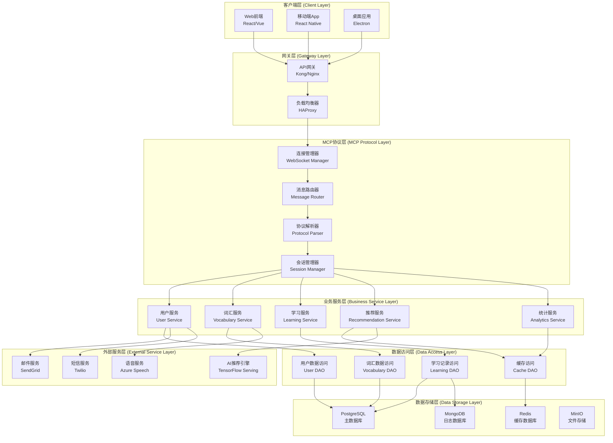
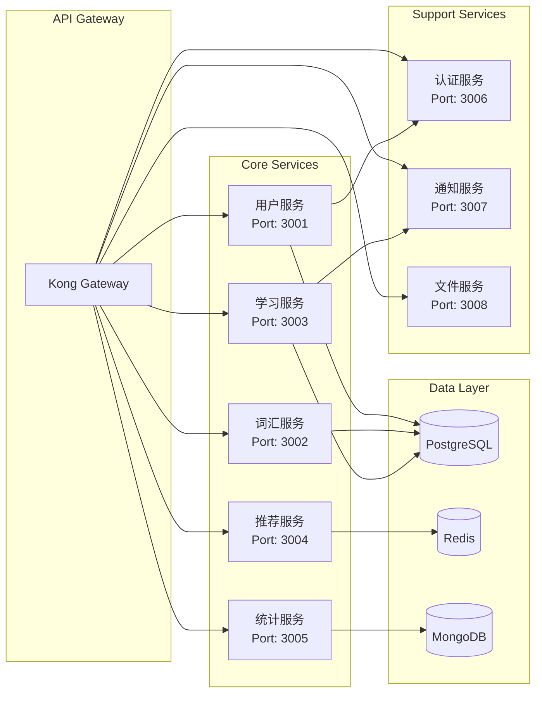
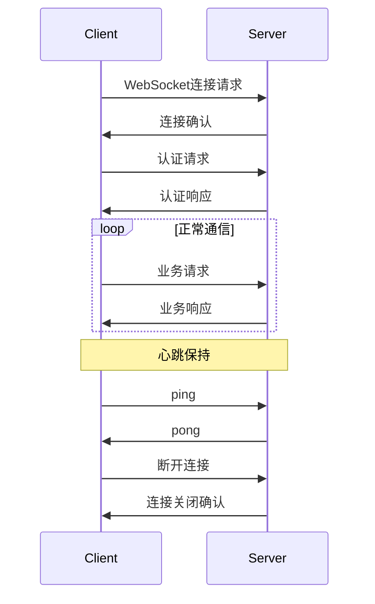

# MCP 背单词服务器 - 技术规格说明书

## 1. 文档概述

本文档详细描述了MCP背单词服务器的技术架构、系统设计、接口规范和实现细节。

### 1.1 文档目的

- 为开发团队提供详细的技术实现指导
- 定义系统架构和技术选型
- 规范接口设计和数据结构
- 指导系统部署和运维

### 1.2 适用范围

- 后端开发工程师
- 前端开发工程师
- 系统架构师
- 运维工程师
- 测试工程师

## 2. 系统架构设计

### 2.1 整体架构



### 2.2 微服务架构



## 3. MCP协议设计

### 3.1 协议概述

MCP (Message Control Protocol) 是基于WebSocket的自定义应用层协议，专为背单词应用设计。

### 3.2 消息格式

#### 基础消息结构

```json
{
  "version": "1.0",
  "messageId": "uuid-string",
  "timestamp": 1640995200000,
  "type": "request|response|notification|error",
  "action": "action-name",
  "payload": {},
  "metadata": {
    "userId": "user-id",
    "sessionId": "session-id",
    "clientInfo": {
      "platform": "web|mobile|desktop",
      "version": "1.0.0"
    }
  }
}
```

#### 消息类型定义

| 类型           | 描述    | 发送方    | 示例     |
| ------------ | ----- | ------ | ------ |
| request      | 客户端请求 | Client | 获取词汇列表 |
| response     | 服务端响应 | Server | 返回词汇数据 |
| notification | 服务端通知 | Server | 学习提醒   |
| error        | 错误消息  | Server | 认证失败   |

### 3.3 协议动作定义

#### 用户管理动作

```typescript
// 用户登录
interface LoginRequest {
  action: 'user.login';
  payload: {
    email: string;
    password: string;
    rememberMe?: boolean;
  };
}

interface LoginResponse {
  action: 'user.login';
  payload: {
    success: boolean;
    token?: string;
    user?: UserProfile;
    error?: string;
  };
}

// 用户注册
interface RegisterRequest {
  action: 'user.register';
  payload: {
    email: string;
    password: string;
    username?: string;
  };
}
```

#### 学习管理动作

```typescript
// 开始学习会话
interface StartLearningRequest {
  action: 'learning.start';
  payload: {
    vocabularyId: string;
    mode: 'recognition' | 'spelling' | 'choice' | 'sentence';
    count: number;
  };
}

interface StartLearningResponse {
  action: 'learning.start';
  payload: {
    sessionId: string;
    words: Word[];
    totalCount: number;
  };
}

// 提交学习结果
interface SubmitLearningRequest {
  action: 'learning.submit';
  payload: {
    sessionId: string;
    wordId: string;
    result: {
      isCorrect: boolean;
      responseTime: number;
      masteryLevel: 1 | 2 | 3 | 4 | 5;
      userAnswer?: string;
    };
  };
}
```

### 3.4 连接管理

#### 连接生命周期



#### 心跳机制

```typescript
interface HeartbeatConfig {
  interval: 30000; // 30秒
  timeout: 10000;  // 10秒超时
  maxRetries: 3;   // 最大重试次数
}

// 心跳消息
interface PingMessage {
  type: 'ping';
  timestamp: number;
}

interface PongMessage {
  type: 'pong';
  timestamp: number;
}
```

## 4. 数据库设计

### 4.1 数据库选型

| 数据库        | 用途    | 理由                 |
| ---------- | ----- | ------------------ |
| PostgreSQL | 主数据库  | ACID特性、复杂查询、JSON支持 |
| Redis      | 缓存数据库 | 高性能、会话存储、排行榜       |
| MongoDB    | 日志数据库 | 文档存储、大数据量、灵活schema |

### 4.2 PostgreSQL数据库设计

#### 用户相关表

```sql
-- 用户表
CREATE TABLE users (
    id UUID PRIMARY KEY DEFAULT gen_random_uuid(),
    username VARCHAR(50) UNIQUE NOT NULL,
    email VARCHAR(255) UNIQUE NOT NULL,
    password_hash VARCHAR(255) NOT NULL,
    salt VARCHAR(255) NOT NULL,
    level INTEGER DEFAULT 1 CHECK (level BETWEEN 1 AND 10),
    preferences JSONB DEFAULT '{}',
    avatar_url VARCHAR(500),
    is_active BOOLEAN DEFAULT true,
    email_verified BOOLEAN DEFAULT false,
    created_at TIMESTAMP WITH TIME ZONE DEFAULT CURRENT_TIMESTAMP,
    updated_at TIMESTAMP WITH TIME ZONE DEFAULT CURRENT_TIMESTAMP,
    last_login_at TIMESTAMP WITH TIME ZONE
);

-- 用户配置表
CREATE TABLE user_settings (
    id UUID PRIMARY KEY DEFAULT gen_random_uuid(),
    user_id UUID NOT NULL REFERENCES users(id) ON DELETE CASCADE,
    daily_goal INTEGER DEFAULT 20,
    reminder_time TIME DEFAULT '09:00:00',
    pronunciation_preference VARCHAR(10) DEFAULT 'us' CHECK (pronunciation_preference IN ('us', 'uk')),
    theme VARCHAR(20) DEFAULT 'light' CHECK (theme IN ('light', 'dark', 'auto')),
    notification_enabled BOOLEAN DEFAULT true,
    created_at TIMESTAMP WITH TIME ZONE DEFAULT CURRENT_TIMESTAMP,
    updated_at TIMESTAMP WITH TIME ZONE DEFAULT CURRENT_TIMESTAMP
);

-- 用户会话表
CREATE TABLE user_sessions (
    id UUID PRIMARY KEY DEFAULT gen_random_uuid(),
    user_id UUID NOT NULL REFERENCES users(id) ON DELETE CASCADE,
    token_hash VARCHAR(255) NOT NULL,
    device_info JSONB,
    ip_address INET,
    expires_at TIMESTAMP WITH TIME ZONE NOT NULL,
    created_at TIMESTAMP WITH TIME ZONE DEFAULT CURRENT_TIMESTAMP
);
```

#### 词汇相关表

```sql
-- 词库表
CREATE TABLE vocabularies (
    id UUID PRIMARY KEY DEFAULT gen_random_uuid(),
    name VARCHAR(100) NOT NULL,
    description TEXT,
    category VARCHAR(50) NOT NULL,
    difficulty_level INTEGER CHECK (difficulty_level BETWEEN 1 AND 10),
    total_words INTEGER DEFAULT 0,
    is_public BOOLEAN DEFAULT true,
    created_by UUID REFERENCES users(id),
    tags TEXT[],
    metadata JSONB DEFAULT '{}',
    created_at TIMESTAMP WITH TIME ZONE DEFAULT CURRENT_TIMESTAMP,
    updated_at TIMESTAMP WITH TIME ZONE DEFAULT CURRENT_TIMESTAMP
);

-- 单词表
CREATE TABLE words (
    id UUID PRIMARY KEY DEFAULT gen_random_uuid(),
    word VARCHAR(100) NOT NULL,
    pronunciation_us VARCHAR(200),
    pronunciation_uk VARCHAR(200),
    definitions JSONB NOT NULL, -- [{"partOfSpeech": "noun", "definition": "...", "example": "..."}]
    difficulty_level INTEGER CHECK (difficulty_level BETWEEN 1 AND 10),
    frequency_rank INTEGER,
    etymology TEXT,
    synonyms TEXT[],
    antonyms TEXT[],
    tags TEXT[],
    audio_url_us VARCHAR(500),
    audio_url_uk VARCHAR(500),
    created_at TIMESTAMP WITH TIME ZONE DEFAULT CURRENT_TIMESTAMP,
    updated_at TIMESTAMP WITH TIME ZONE DEFAULT CURRENT_TIMESTAMP
);

-- 词库单词关联表
CREATE TABLE vocabulary_words (
    id UUID PRIMARY KEY DEFAULT gen_random_uuid(),
    vocabulary_id UUID NOT NULL REFERENCES vocabularies(id) ON DELETE CASCADE,
    word_id UUID NOT NULL REFERENCES words(id) ON DELETE CASCADE,
    order_index INTEGER,
    created_at TIMESTAMP WITH TIME ZONE DEFAULT CURRENT_TIMESTAMP,
    UNIQUE(vocabulary_id, word_id)
);
```

#### 学习相关表

```sql
-- 用户词汇状态表
CREATE TABLE user_word_status (
    id UUID PRIMARY KEY DEFAULT gen_random_uuid(),
    user_id UUID NOT NULL REFERENCES users(id) ON DELETE CASCADE,
    word_id UUID NOT NULL REFERENCES words(id) ON DELETE CASCADE,
    mastery_level INTEGER DEFAULT 0 CHECK (mastery_level BETWEEN 0 AND 5),
    review_count INTEGER DEFAULT 0,
    correct_count INTEGER DEFAULT 0,
    last_reviewed_at TIMESTAMP WITH TIME ZONE,
    next_review_at TIMESTAMP WITH TIME ZONE,
    confidence_score DECIMAL(3,2) DEFAULT 0.0 CHECK (confidence_score BETWEEN 0.0 AND 1.0),
    learning_phase VARCHAR(20) DEFAULT 'new' CHECK (learning_phase IN ('new', 'learning', 'review', 'mastered')),
    created_at TIMESTAMP WITH TIME ZONE DEFAULT CURRENT_TIMESTAMP,
    updated_at TIMESTAMP WITH TIME ZONE DEFAULT CURRENT_TIMESTAMP,
    UNIQUE(user_id, word_id)
);

-- 学习会话表
CREATE TABLE learning_sessions (
    id UUID PRIMARY KEY DEFAULT gen_random_uuid(),
    user_id UUID NOT NULL REFERENCES users(id) ON DELETE CASCADE,
    vocabulary_id UUID REFERENCES vocabularies(id),
    session_type VARCHAR(20) NOT NULL CHECK (session_type IN ('learning', 'review', 'test')),
    learning_mode VARCHAR(20) NOT NULL CHECK (learning_mode IN ('recognition', 'spelling', 'choice', 'sentence')),
    total_words INTEGER NOT NULL,
    completed_words INTEGER DEFAULT 0,
    correct_answers INTEGER DEFAULT 0,
    total_time_seconds INTEGER DEFAULT 0,
    started_at TIMESTAMP WITH TIME ZONE DEFAULT CURRENT_TIMESTAMP,
    completed_at TIMESTAMP WITH TIME ZONE,
    status VARCHAR(20) DEFAULT 'active' CHECK (status IN ('active', 'paused', 'completed', 'abandoned'))
);

-- 学习记录表
CREATE TABLE learning_records (
    id UUID PRIMARY KEY DEFAULT gen_random_uuid(),
    session_id UUID NOT NULL REFERENCES learning_sessions(id) ON DELETE CASCADE,
    user_id UUID NOT NULL REFERENCES users(id) ON DELETE CASCADE,
    word_id UUID NOT NULL REFERENCES words(id) ON DELETE CASCADE,
    action_type VARCHAR(20) NOT NULL CHECK (action_type IN ('view', 'answer', 'skip', 'hint')),
    is_correct BOOLEAN,
    user_answer TEXT,
    response_time_ms INTEGER,
    mastery_before INTEGER,
    mastery_after INTEGER,
    created_at TIMESTAMP WITH TIME ZONE DEFAULT CURRENT_TIMESTAMP
);
```

#### 统计相关表

```sql
-- 用户学习统计表
CREATE TABLE user_learning_stats (
    id UUID PRIMARY KEY DEFAULT gen_random_uuid(),
    user_id UUID NOT NULL REFERENCES users(id) ON DELETE CASCADE,
    date DATE NOT NULL,
    words_learned INTEGER DEFAULT 0,
    words_reviewed INTEGER DEFAULT 0,
    study_time_minutes INTEGER DEFAULT 0,
    sessions_completed INTEGER DEFAULT 0,
    accuracy_rate DECIMAL(5,2) DEFAULT 0.0,
    streak_days INTEGER DEFAULT 0,
    created_at TIMESTAMP WITH TIME ZONE DEFAULT CURRENT_TIMESTAMP,
    updated_at TIMESTAMP WITH TIME ZONE DEFAULT CURRENT_TIMESTAMP,
    UNIQUE(user_id, date)
);

-- 系统统计表
CREATE TABLE system_stats (
    id UUID PRIMARY KEY DEFAULT gen_random_uuid(),
    metric_name VARCHAR(50) NOT NULL,
    metric_value DECIMAL(15,2) NOT NULL,
    date DATE NOT NULL,
    metadata JSONB DEFAULT '{}',
    created_at TIMESTAMP WITH TIME ZONE DEFAULT CURRENT_TIMESTAMP,
    UNIQUE(metric_name, date)
);
```

### 4.3 Redis数据结构设计

#### 缓存策略

```typescript
// 用户会话缓存
interface UserSession {
  key: `session:${sessionId}`;
  value: {
    userId: string;
    username: string;
    level: number;
    lastActivity: number;
  };
  ttl: 7 * 24 * 3600; // 7天
}

// 用户在线状态
interface UserOnlineStatus {
  key: `online:${userId}`;
  value: {
    socketId: string;
    lastSeen: number;
    platform: string;
  };
  ttl: 300; // 5分钟
}

// 词汇缓存
interface WordCache {
  key: `word:${wordId}`;
  value: Word;
  ttl: 3600; // 1小时
}

// 学习进度缓存
interface LearningProgress {
  key: `progress:${userId}:${vocabularyId}`;
  value: {
    totalWords: number;
    learnedWords: number;
    masteredWords: number;
    lastUpdated: number;
  };
  ttl: 1800; // 30分钟
}
```

#### 排行榜设计

```typescript
// 每日学习排行榜
interface DailyLeaderboard {
  key: `leaderboard:daily:${date}`;
  type: 'ZSET';
  score: number; // 学习词汇数
  member: string; // 用户ID
}

// 连续学习天数排行榜
interface StreakLeaderboard {
  key: `leaderboard:streak`;
  type: 'ZSET';
  score: number; // 连续天数
  member: string; // 用户ID
}
```

### 4.4 MongoDB日志设计

#### 用户行为日志

```typescript
interface UserActionLog {
  _id: ObjectId;
  userId: string;
  sessionId: string;
  action: string;
  details: {
    wordId?: string;
    vocabularyId?: string;
    result?: any;
    duration?: number;
  };
  userAgent: string;
  ipAddress: string;
  timestamp: Date;
  metadata: Record<string, any>;
}

// 索引设计
// db.user_action_logs.createIndex({ "userId": 1, "timestamp": -1 })
// db.user_action_logs.createIndex({ "action": 1, "timestamp": -1 })
// db.user_action_logs.createIndex({ "timestamp": -1 })
```

#### 系统错误日志

```typescript
interface ErrorLog {
  _id: ObjectId;
  level: 'error' | 'warn' | 'info';
  message: string;
  stack?: string;
  service: string;
  userId?: string;
  requestId?: string;
  context: Record<string, any>;
  timestamp: Date;
}
```

## 5. AI集成设计

### 5.1 大模型调用方案

1. **API集成**:
   - 使用OpenAI/GPT或类似大模型API
   - 为每个用户请求附加兴趣标签(科技/体育等)
   - 示例请求:
     
     ```json
     {
     "word": "innovation",
     "interests": ["科技", "商业"],
     "language_level": "intermediate"
     }
     ```
2. **缓存机制**:
   - 高频单词+兴趣组合缓存24小时
   - 本地例句库优先检查
3. **限流策略**:
   - 每个用户每分钟最多5次大模型请求
   - 失败时回退到通用例句库

## 6. 用户生成内容存储

### 6.1 例句存储方案

1. **客户端操作命令**:
   
   - 添加例句: `mcp add-example "innovation" "Tech innovation drives progress"`
   - 本地保存格式: JSON文件存储用户创建的例句
   - 同步命令: `mcp sync-examples` 将本地例句上传至服务器

2. **服务端存储设计**:
   
   - 用户例句表(user_examples)包含字段:
     - user_id, word, example, created_at, status
   - 审核通过后进入公共例句库

3. **数据库设计**:
   
   - 新增`user_examples`表
     
     ```sql
     CREATE TABLE user_examples (
     id SERIAL PRIMARY KEY,
     user_id INTEGER REFERENCES users(id),
     word_id INTEGER REFERENCES vocabulary(id),
     example_text TEXT NOT NULL,
     created_at TIMESTAMP DEFAULT NOW(),
     likes INTEGER DEFAULT 0
     );
     ```

4. **存储流程**:
   
   - 用户提交的例句先经过内容审核
   - 通过后存入数据库并关联用户ID

5. **使用策略**:
   
   - 优质例句(点赞>10)进入公共例句库
   - 个人例句优先展示给创建者

## 7. API设计规范

### 5.1 RESTful API设计

#### 基础URL结构

```
https://api.words-mcp.com/v1/{resource}
```

#### 资源命名规范

| 资源  | URL             | 描述   |
| --- | --------------- | ---- |
| 用户  | `/users`        | 用户管理 |
| 词汇  | `/vocabularies` | 词库管理 |
| 单词  | `/words`        | 单词管理 |
| 学习  | `/learning`     | 学习相关 |
| 统计  | `/stats`        | 统计数据 |

#### HTTP方法使用

| 方法     | 用途   | 示例                         |
| ------ | ---- | -------------------------- |
| GET    | 获取资源 | `GET /users/123`           |
| POST   | 创建资源 | `POST /vocabularies`       |
| PUT    | 完整更新 | `PUT /users/123`           |
| PATCH  | 部分更新 | `PATCH /users/123`         |
| DELETE | 删除资源 | `DELETE /vocabularies/123` |

### 5.2 API响应格式

#### 成功响应

```typescript
interface SuccessResponse<T> {
  success: true;
  data: T;
  message?: string;
  metadata?: {
    pagination?: {
      page: number;
      limit: number;
      total: number;
      totalPages: number;
    };
    timestamp: number;
    requestId: string;
  };
}
```

#### 错误响应

```typescript
interface ErrorResponse {
  success: false;
  error: {
    code: string;
    message: string;
    details?: any;
  };
  metadata: {
    timestamp: number;
    requestId: string;
  };
}
```

### 5.3 主要API接口

#### 用户管理API

```typescript
// 用户注册
POST /api/v1/users/register
Content-Type: application/json

{
  "email": "user@example.com",
  "password": "password123",
  "username": "testuser"
}

// 用户登录
POST /api/v1/users/login
Content-Type: application/json

{
  "email": "user@example.com",
  "password": "password123",
  "rememberMe": true
}

// 获取用户信息
GET /api/v1/users/profile
Authorization: Bearer {token}

// 更新用户设置
PATCH /api/v1/users/settings
Authorization: Bearer {token}
Content-Type: application/json

{
  "dailyGoal": 30,
  "reminderTime": "09:00",
  "theme": "dark"
}
```

#### 词汇管理API

```typescript
// 获取词库列表
GET /api/v1/vocabularies?category=cet4&difficulty=3&page=1&limit=20
Authorization: Bearer {token}

// 获取词库详情
GET /api/v1/vocabularies/{vocabularyId}
Authorization: Bearer {token}

// 获取词库中的单词
GET /api/v1/vocabularies/{vocabularyId}/words?page=1&limit=50
Authorization: Bearer {token}

// 创建自定义词库
POST /api/v1/vocabularies
Authorization: Bearer {token}
Content-Type: application/json

{
  "name": "我的词库",
  "description": "个人学习词库",
  "category": "custom",
  "isPublic": false
}
```

#### 学习管理API

```typescript
// 开始学习会话
POST /api/v1/learning/sessions
Authorization: Bearer {token}
Content-Type: application/json

{
  "vocabularyId": "vocab-uuid",
  "mode": "recognition",
  "count": 20
}

// 提交学习结果
POST /api/v1/learning/sessions/{sessionId}/submit
Authorization: Bearer {token}
Content-Type: application/json

{
  "wordId": "word-uuid",
  "isCorrect": true,
  "responseTime": 2500,
  "masteryLevel": 4
}

// 获取学习统计
GET /api/v1/learning/stats?period=week
Authorization: Bearer {token}

// 获取复习计划
GET /api/v1/learning/review-plan
Authorization: Bearer {token}
```

## 6. 安全设计

### 6.1 认证和授权

#### JWT Token设计

```typescript
interface JWTPayload {
  sub: string; // 用户ID
  username: string;
  email: string;
  role: 'student' | 'teacher' | 'admin';
  level: number;
  iat: number; // 签发时间
  exp: number; // 过期时间
  jti: string; // Token ID
}

// Token配置
interface TokenConfig {
  accessTokenExpiry: '15m';
  refreshTokenExpiry: '7d';
  algorithm: 'HS256';
  issuer: 'words-mcp-server';
}
```

#### 权限控制

```typescript
// 权限定义
enum Permission {
  READ_OWN_PROFILE = 'read:own:profile',
  UPDATE_OWN_PROFILE = 'update:own:profile',
  READ_VOCABULARIES = 'read:vocabularies',
  CREATE_VOCABULARY = 'create:vocabulary',
  UPDATE_OWN_VOCABULARY = 'update:own:vocabulary',
  DELETE_OWN_VOCABULARY = 'delete:own:vocabulary',
  READ_LEARNING_DATA = 'read:learning:data',
  WRITE_LEARNING_DATA = 'write:learning:data',
  ADMIN_USERS = 'admin:users',
  ADMIN_SYSTEM = 'admin:system'
}

// 角色权限映射
const rolePermissions = {
  student: [
    Permission.READ_OWN_PROFILE,
    Permission.UPDATE_OWN_PROFILE,
    Permission.READ_VOCABULARIES,
    Permission.CREATE_VOCABULARY,
    Permission.UPDATE_OWN_VOCABULARY,
    Permission.DELETE_OWN_VOCABULARY,
    Permission.READ_LEARNING_DATA,
    Permission.WRITE_LEARNING_DATA
  ],
  teacher: [
    // 包含student所有权限
    ...rolePermissions.student,
    // 额外权限
    Permission.READ_STUDENT_DATA,
    Permission.MANAGE_CLASS
  ],
  admin: [
    // 包含所有权限
    ...Object.values(Permission)
  ]
};
```

### 6.2 数据安全

#### 密码安全

```typescript
import bcrypt from 'bcrypt';
import crypto from 'crypto';

class PasswordSecurity {
  private static readonly SALT_ROUNDS = 12;

  static async hashPassword(password: string): Promise<{hash: string, salt: string}> {
    const salt = crypto.randomBytes(32).toString('hex');
    const hash = await bcrypt.hash(password + salt, this.SALT_ROUNDS);
    return { hash, salt };
  }

  static async verifyPassword(password: string, hash: string, salt: string): Promise<boolean> {
    return bcrypt.compare(password + salt, hash);
  }

  static validatePasswordStrength(password: string): boolean {
    // 至少8位，包含大小写字母、数字和特殊字符
    const regex = /^(?=.*[a-z])(?=.*[A-Z])(?=.*\d)(?=.*[@$!%*?&])[A-Za-z\d@$!%*?&]{8,}$/;
    return regex.test(password);
  }
}
```

#### 数据加密

```typescript
import crypto from 'crypto';

class DataEncryption {
  private static readonly ALGORITHM = 'aes-256-gcm';
  private static readonly KEY = process.env.ENCRYPTION_KEY!;

  static encrypt(text: string): {encrypted: string, iv: string, tag: string} {
    const iv = crypto.randomBytes(16);
    const cipher = crypto.createCipher(this.ALGORITHM, this.KEY);
    cipher.setAAD(Buffer.from('words-mcp', 'utf8'));

    let encrypted = cipher.update(text, 'utf8', 'hex');
    encrypted += cipher.final('hex');

    const tag = cipher.getAuthTag();

    return {
      encrypted,
      iv: iv.toString('hex'),
      tag: tag.toString('hex')
    };
  }

  static decrypt(encrypted: string, iv: string, tag: string): string {
    const decipher = crypto.createDecipher(this.ALGORITHM, this.KEY);
    decipher.setAAD(Buffer.from('words-mcp', 'utf8'));
    decipher.setAuthTag(Buffer.from(tag, 'hex'));

    let decrypted = decipher.update(encrypted, 'hex', 'utf8');
    decrypted += decipher.final('utf8');

    return decrypted;
  }
}
```

### 6.3 API安全

#### 请求限流

```typescript
import rateLimit from 'express-rate-limit';

// 通用限流
const generalLimiter = rateLimit({
  windowMs: 15 * 60 * 1000, // 15分钟
  max: 100, // 最多100个请求
  message: 'Too many requests from this IP',
  standardHeaders: true,
  legacyHeaders: false
});

// 登录限流
const loginLimiter = rateLimit({
  windowMs: 15 * 60 * 1000, // 15分钟
  max: 5, // 最多5次登录尝试
  skipSuccessfulRequests: true,
  message: 'Too many login attempts'
});

// 注册限流
const registerLimiter = rateLimit({
  windowMs: 60 * 60 * 1000, // 1小时
  max: 3, // 最多3次注册
  message: 'Too many registration attempts'
});
```

#### 输入验证

```typescript
import Joi from 'joi';

// 用户注册验证
const registerSchema = Joi.object({
  email: Joi.string().email().required(),
  password: Joi.string().min(8).pattern(/^(?=.*[a-z])(?=.*[A-Z])(?=.*\d)(?=.*[@$!%*?&])[A-Za-z\d@$!%*?&]{8,}$/).required(),
  username: Joi.string().alphanum().min(3).max(30).optional()
});

// 学习会话验证
const learningSessionSchema = Joi.object({
  vocabularyId: Joi.string().uuid().required(),
  mode: Joi.string().valid('recognition', 'spelling', 'choice', 'sentence').required(),
  count: Joi.number().integer().min(1).max(100).required()
});

// 中间件
const validateRequest = (schema: Joi.ObjectSchema) => {
  return (req: Request, res: Response, next: NextFunction) => {
    const { error } = schema.validate(req.body);
    if (error) {
      return res.status(400).json({
        success: false,
        error: {
          code: 'VALIDATION_ERROR',
          message: error.details[0].message
        }
      });
    }
    next();
  };
};
```

## 7. 性能优化

### 7.1 数据库优化

#### 索引策略

```sql
-- 用户表索引
CREATE INDEX idx_users_email ON users(email);
CREATE INDEX idx_users_username ON users(username);
CREATE INDEX idx_users_created_at ON users(created_at);

-- 单词表索引
CREATE INDEX idx_words_word ON words(word);
CREATE INDEX idx_words_difficulty ON words(difficulty_level);
CREATE INDEX idx_words_frequency ON words(frequency_rank);
CREATE INDEX idx_words_tags ON words USING GIN(tags);

-- 学习记录索引
CREATE INDEX idx_learning_records_user_word ON learning_records(user_id, word_id);
CREATE INDEX idx_learning_records_session ON learning_records(session_id);
CREATE INDEX idx_learning_records_created_at ON learning_records(created_at);

-- 用户词汇状态索引
CREATE INDEX idx_user_word_status_user ON user_word_status(user_id);
CREATE INDEX idx_user_word_status_next_review ON user_word_status(next_review_at) WHERE next_review_at IS NOT NULL;
CREATE INDEX idx_user_word_status_mastery ON user_word_status(mastery_level);
```

#### 查询优化

```sql
-- 获取用户需要复习的词汇（优化版）
WITH review_words AS (
  SELECT 
    uws.word_id,
    uws.mastery_level,
    uws.next_review_at,
    w.word,
    w.definitions
  FROM user_word_status uws
  JOIN words w ON uws.word_id = w.id
  WHERE uws.user_id = $1
    AND uws.next_review_at <= CURRENT_TIMESTAMP
    AND uws.mastery_level < 5
  ORDER BY uws.next_review_at ASC
  LIMIT 50
)
SELECT * FROM review_words;

-- 获取学习统计（优化版）
SELECT 
  DATE(created_at) as date,
  COUNT(DISTINCT word_id) as words_learned,
  SUM(CASE WHEN is_correct THEN 1 ELSE 0 END) as correct_answers,
  COUNT(*) as total_answers,
  ROUND(AVG(response_time_ms)) as avg_response_time
FROM learning_records
WHERE user_id = $1
  AND created_at >= CURRENT_DATE - INTERVAL '30 days'
GROUP BY DATE(created_at)
ORDER BY date DESC;
```

### 7.2 缓存策略

#### 多级缓存

```typescript
class CacheManager {
  private redis: Redis;
  private memoryCache: Map<string, any>;

  constructor() {
    this.redis = new Redis(process.env.REDIS_URL);
    this.memoryCache = new Map();
  }

  async get(key: string): Promise<any> {
    // L1: 内存缓存
    if (this.memoryCache.has(key)) {
      return this.memoryCache.get(key);
    }

    // L2: Redis缓存
    const redisValue = await this.redis.get(key);
    if (redisValue) {
      const parsed = JSON.parse(redisValue);
      this.memoryCache.set(key, parsed);
      return parsed;
    }

    return null;
  }

  async set(key: string, value: any, ttl: number = 3600): Promise<void> {
    // 设置内存缓存
    this.memoryCache.set(key, value);

    // 设置Redis缓存
    await this.redis.setex(key, ttl, JSON.stringify(value));
  }

  async invalidate(pattern: string): Promise<void> {
    // 清除内存缓存
    for (const key of this.memoryCache.keys()) {
      if (key.includes(pattern)) {
        this.memoryCache.delete(key);
      }
    }

    // 清除Redis缓存
    const keys = await this.redis.keys(`*${pattern}*`);
    if (keys.length > 0) {
      await this.redis.del(...keys);
    }
  }
}
```

#### 缓存预热

```typescript
class CacheWarmer {
  private cacheManager: CacheManager;

  async warmupUserData(userId: string): Promise<void> {
    // 预热用户基本信息
    const user = await this.userService.getUserById(userId);
    await this.cacheManager.set(`user:${userId}`, user, 3600);

    // 预热用户学习进度
    const progress = await this.learningService.getUserProgress(userId);
    await this.cacheManager.set(`progress:${userId}`, progress, 1800);

    // 预热用户词汇状态
    const wordStatus = await this.learningService.getUserWordStatus(userId);
    await this.cacheManager.set(`word_status:${userId}`, wordStatus, 1800);
  }

  async warmupVocabularyData(vocabularyId: string): Promise<void> {
    // 预热词库信息
    const vocabulary = await this.vocabularyService.getVocabularyById(vocabularyId);
    await this.cacheManager.set(`vocabulary:${vocabularyId}`, vocabulary, 7200);

    // 预热词库单词
    const words = await this.vocabularyService.getVocabularyWords(vocabularyId);
    await this.cacheManager.set(`vocabulary_words:${vocabularyId}`, words, 7200);
  }
}
```

### 7.3 连接池优化

#### 数据库连接池

```typescript
import { Pool } from 'pg';

const dbPool = new Pool({
  host: process.env.DB_HOST,
  port: parseInt(process.env.DB_PORT || '5432'),
  database: process.env.DB_NAME,
  user: process.env.DB_USER,
  password: process.env.DB_PASSWORD,

  // 连接池配置
  min: 5,           // 最小连接数
  max: 20,          // 最大连接数
  idleTimeoutMillis: 30000,  // 空闲超时
  connectionTimeoutMillis: 2000,  // 连接超时

  // SSL配置
  ssl: process.env.NODE_ENV === 'production' ? {
    rejectUnauthorized: false
  } : false
});

// 连接池监控
dbPool.on('connect', (client) => {
  console.log('New database connection established');
});

dbPool.on('error', (err) => {
  console.error('Database pool error:', err);
});
```

#### Redis连接池

```typescript
import Redis from 'ioredis';

const redisCluster = new Redis.Cluster([
  {
    host: process.env.REDIS_HOST_1,
    port: parseInt(process.env.REDIS_PORT_1 || '6379')
  },
  {
    host: process.env.REDIS_HOST_2,
    port: parseInt(process.env.REDIS_PORT_2 || '6379')
  }
], {
  redisOptions: {
    password: process.env.REDIS_PASSWORD,
    connectTimeout: 10000,
    lazyConnect: true,
    maxRetriesPerRequest: 3
  },

  // 连接池配置
  enableOfflineQueue: false,
  retryDelayOnFailover: 100,
  maxRetriesPerRequest: 3
});
```

## 8. 监控和日志

### 8.1 应用监控

#### 性能指标监控

```typescript
import prometheus from 'prom-client';

// 创建指标
const httpRequestDuration = new prometheus.Histogram({
  name: 'http_request_duration_seconds',
  help: 'Duration of HTTP requests in seconds',
  labelNames: ['method', 'route', 'status_code'],
  buckets: [0.1, 0.3, 0.5, 0.7, 1, 3, 5, 7, 10]
});

const httpRequestTotal = new prometheus.Counter({
  name: 'http_requests_total',
  help: 'Total number of HTTP requests',
  labelNames: ['method', 'route', 'status_code']
});

const activeConnections = new prometheus.Gauge({
  name: 'websocket_connections_active',
  help: 'Number of active WebSocket connections'
});

const learningSessionsTotal = new prometheus.Counter({
  name: 'learning_sessions_total',
  help: 'Total number of learning sessions',
  labelNames: ['mode', 'status']
});

// 中间件
const metricsMiddleware = (req: Request, res: Response, next: NextFunction) => {
  const start = Date.now();

  res.on('finish', () => {
    const duration = (Date.now() - start) / 1000;
    const labels = {
      method: req.method,
      route: req.route?.path || req.path,
      status_code: res.statusCode.toString()
    };

    httpRequestDuration.observe(labels, duration);
    httpRequestTotal.inc(labels);
  });

  next();
};
```

#### 健康检查

```typescript
interface HealthCheckResult {
  status: 'healthy' | 'unhealthy';
  timestamp: number;
  services: {
    database: 'up' | 'down';
    redis: 'up' | 'down';
    external_apis: 'up' | 'down';
  };
  metrics: {
    uptime: number;
    memory_usage: number;
    cpu_usage: number;
  };
}

class HealthChecker {
  async checkHealth(): Promise<HealthCheckResult> {
    const checks = await Promise.allSettled([
      this.checkDatabase(),
      this.checkRedis(),
      this.checkExternalAPIs()
    ]);

    const services = {
      database: checks[0].status === 'fulfilled' ? 'up' : 'down',
      redis: checks[1].status === 'fulfilled' ? 'up' : 'down',
      external_apis: checks[2].status === 'fulfilled' ? 'up' : 'down'
    };

    const allHealthy = Object.values(services).every(status => status === 'up');

    return {
      status: allHealthy ? 'healthy' : 'unhealthy',
      timestamp: Date.now(),
      services,
      metrics: {
        uptime: process.uptime(),
        memory_usage: process.memoryUsage().heapUsed / 1024 / 1024,
        cpu_usage: process.cpuUsage().user / 1000000
      }
    };
  }

  private async checkDatabase(): Promise<void> {
    await dbPool.query('SELECT 1');
  }

  private async checkRedis(): Promise<void> {
    await redisClient.ping();
  }

  private async checkExternalAPIs(): Promise<void> {
    // 检查外部API可用性
    const response = await fetch('https://api.external-service.com/health');
    if (!response.ok) {
      throw new Error('External API unavailable');
    }
  }
}
```

### 8.2 日志系统

#### 结构化日志

```typescript
import winston from 'winston';

const logger = winston.createLogger({
  level: process.env.LOG_LEVEL || 'info',
  format: winston.format.combine(
    winston.format.timestamp(),
    winston.format.errors({ stack: true }),
    winston.format.json()
  ),
  defaultMeta: {
    service: 'words-mcp-server',
    version: process.env.APP_VERSION || '1.0.0'
  },
  transports: [
    new winston.transports.File({ 
      filename: 'logs/error.log', 
      level: 'error' 
    }),
    new winston.transports.File({ 
      filename: 'logs/combined.log' 
    }),
    new winston.transports.Console({
      format: winston.format.combine(
        winston.format.colorize(),
        winston.format.simple()
      )
    })
  ]
});

// 日志中间件
const loggerMiddleware = (req: Request, res: Response, next: NextFunction) => {
  const requestId = req.headers['x-request-id'] || generateRequestId();
  req.requestId = requestId;

  logger.info('HTTP Request', {
    requestId,
    method: req.method,
    url: req.url,
    userAgent: req.get('User-Agent'),
    ip: req.ip,
    userId: req.user?.id
  });

  const start = Date.now();

  res.on('finish', () => {
    const duration = Date.now() - start;

    logger.info('HTTP Response', {
      requestId,
      statusCode: res.statusCode,
      duration,
      contentLength: res.get('Content-Length')
    });
  });

  next();
};
```

## 9. 部署和运维

### 9.1 Docker化部署

#### Dockerfile

```dockerfile
# 多阶段构建
FROM node:18-alpine AS builder

WORKDIR /app

# 复制依赖文件
COPY package*.json ./
COPY tsconfig.json ./

# 安装依赖
RUN npm ci --only=production

# 复制源代码
COPY src/ ./src/

# 构建应用
RUN npm run build

# 生产镜像
FROM node:18-alpine AS production

# 创建非root用户
RUN addgroup -g 1001 -S nodejs
RUN adduser -S nextjs -u 1001

WORKDIR /app

# 复制构建产物
COPY --from=builder --chown=nextjs:nodejs /app/dist ./dist
COPY --from=builder --chown=nextjs:nodejs /app/node_modules ./node_modules
COPY --from=builder --chown=nextjs:nodejs /app/package.json ./package.json

# 切换到非root用户
USER nextjs

# 暴露端口
EXPOSE 3000

# 健康检查
HEALTHCHECK --interval=30s --timeout=3s --start-period=5s --retries=3 \
  CMD curl -f http://localhost:3000/health || exit 1

# 启动应用
CMD ["node", "dist/index.js"]
```

#### docker-compose.yml

```yaml
version: '3.8'

services:
  app:
    build: .
    ports:
      - "3000:3000"
    environment:
      - NODE_ENV=production
      - DB_HOST=postgres
      - REDIS_HOST=redis
      - JWT_SECRET=${JWT_SECRET}
    depends_on:
      - postgres
      - redis
    restart: unless-stopped
    networks:
      - app-network

  postgres:
    image: postgres:14-alpine
    environment:
      - POSTGRES_DB=words_mcp
      - POSTGRES_USER=postgres
      - POSTGRES_PASSWORD=${DB_PASSWORD}
    volumes:
      - postgres_data:/var/lib/postgresql/data
      - ./init.sql:/docker-entrypoint-initdb.d/init.sql
    restart: unless-stopped
    networks:
      - app-network

  redis:
    image: redis:7-alpine
    command: redis-server --requirepass ${REDIS_PASSWORD}
    volumes:
      - redis_data:/data
    restart: unless-stopped
    networks:
      - app-network

  nginx:
    image: nginx:alpine
    ports:
      - "80:80"
      - "443:443"
    volumes:
      - ./nginx.conf:/etc/nginx/nginx.conf
      - ./ssl:/etc/nginx/ssl
    depends_on:
      - app
    restart: unless-stopped
    networks:
      - app-network

volumes:
  postgres_data:
  redis_data:

networks:
  app-network:
    driver: bridge
```

### 9.2 Kubernetes部署

#### 应用部署配置

```yaml
apiVersion: apps/v1
kind: Deployment
metadata:
  name: words-mcp-server
  labels:
    app: words-mcp-server
spec:
  replicas: 3
  selector:
    matchLabels:
      app: words-mcp-server
  template:
    metadata:
      labels:
        app: words-mcp-server
    spec:
      containers:
      - name: app
        image: words-mcp-server:latest
        ports:
        - containerPort: 3000
        env:
        - name: NODE_ENV
          value: "production"
        - name: DB_HOST
          value: "postgres-service"
        - name: REDIS_HOST
          value: "redis-service"
        - name: JWT_SECRET
          valueFrom:
            secretKeyRef:
              name: app-secrets
              key: jwt-secret
        resources:
          requests:
            memory: "256Mi"
            cpu: "250m"
          limits:
            memory: "512Mi"
            cpu: "500m"
        livenessProbe:
          httpGet:
            path: /health
            port: 3000
          initialDelaySeconds: 30
          periodSeconds: 10
        readinessProbe:
          httpGet:
            path: /ready
            port: 3000
          initialDelaySeconds: 5
          periodSeconds: 5
---
apiVersion: v1
kind: Service
metadata:
  name: words-mcp-service
spec:
  selector:
    app: words-mcp-server
  ports:
  - protocol: TCP
    port: 80
    targetPort: 3000
  type: LoadBalancer
```

### 9.3 CI/CD流水线

#### GitHub Actions配置

```yaml
name: CI/CD Pipeline

on:
  push:
    branches: [ main, develop ]
  pull_request:
    branches: [ main ]

jobs:
  test:
    runs-on: ubuntu-latest

    services:
      postgres:
        image: postgres:14
        env:
          POSTGRES_PASSWORD: test
          POSTGRES_DB: test
        options: >-
          --health-cmd pg_isready
          --health-interval 10s
          --health-timeout 5s
          --health-retries 5

      redis:
        image: redis:7
        options: >-
          --health-cmd "redis-cli ping"
          --health-interval 10s
          --health-timeout 5s
          --health-retries 5

    steps:
    - uses: actions/checkout@v3

    - name: Setup Node.js
      uses: actions/setup-node@v3
      with:
        node-version: '18'
        cache: 'npm'

    - name: Install dependencies
      run: npm ci

    - name: Run linting
      run: npm run lint

    - name: Run type checking
      run: npm run type-check

    - name: Run tests
      run: npm run test:coverage
      env:
        DB_HOST: localhost
        DB_PORT: 5432
        DB_NAME: test
        DB_USER: postgres
        DB_PASSWORD: test
        REDIS_HOST: localhost
        REDIS_PORT: 6379

    - name: Upload coverage to Codecov
      uses: codecov/codecov-action@v3

  build-and-deploy:
    needs: test
    runs-on: ubuntu-latest
    if: github.ref == 'refs/heads/main'

    steps:
    - uses: actions/checkout@v3

    - name: Configure AWS credentials
      uses: aws-actions/configure-aws-credentials@v2
      with:
        aws-access-key-id: ${{ secrets.AWS_ACCESS_KEY_ID }}
        aws-secret-access-key: ${{ secrets.AWS_SECRET_ACCESS_KEY }}
        aws-region: us-west-2

    - name: Login to Amazon ECR
      id: login-ecr
      uses: aws-actions/amazon-ecr-login@v1

    - name: Build and push Docker image
      env:
        ECR_REGISTRY: ${{ steps.login-ecr.outputs.registry }}
        ECR_REPOSITORY: words-mcp-server
        IMAGE_TAG: ${{ github.sha }}
      run: |
        docker build -t $ECR_REGISTRY/$ECR_REPOSITORY:$IMAGE_TAG .
        docker push $ECR_REGISTRY/$ECR_REPOSITORY:$IMAGE_TAG
        docker tag $ECR_REGISTRY/$ECR_REPOSITORY:$IMAGE_TAG $ECR_REGISTRY/$ECR_REPOSITORY:latest
        docker push $ECR_REGISTRY/$ECR_REPOSITORY:latest

    - name: Deploy to EKS
      run: |
        aws eks update-kubeconfig --name production-cluster
        kubectl set image deployment/words-mcp-server app=$ECR_REGISTRY/$ECR_REPOSITORY:$IMAGE_TAG
        kubectl rollout status deployment/words-mcp-server
```

---

*本技术规格说明书将根据项目进展和技术演进持续更新和完善。*