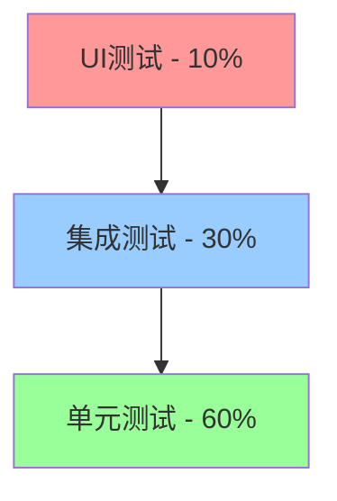
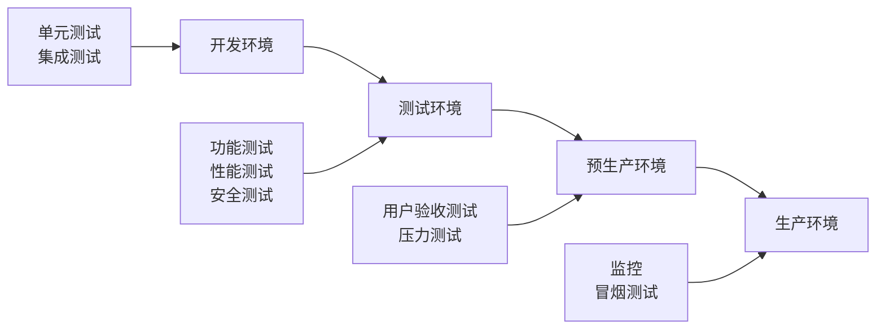
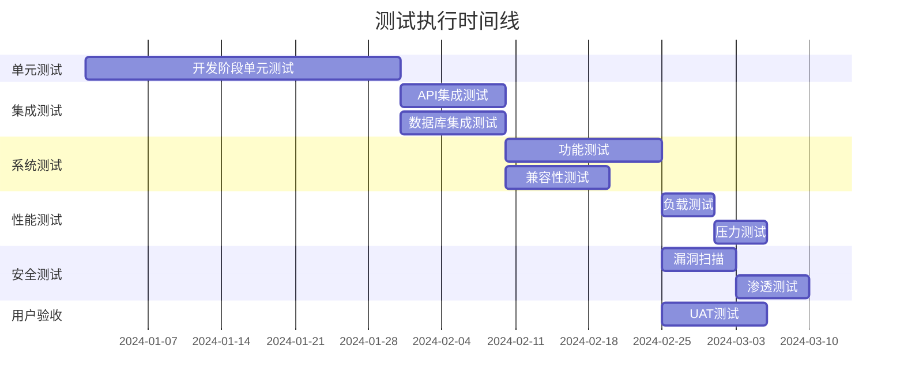
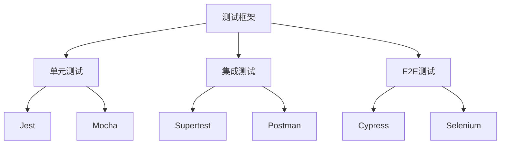
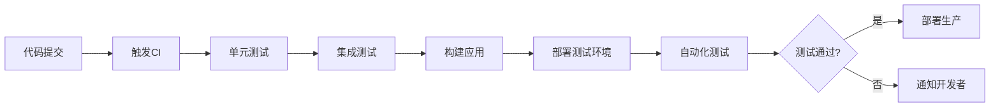
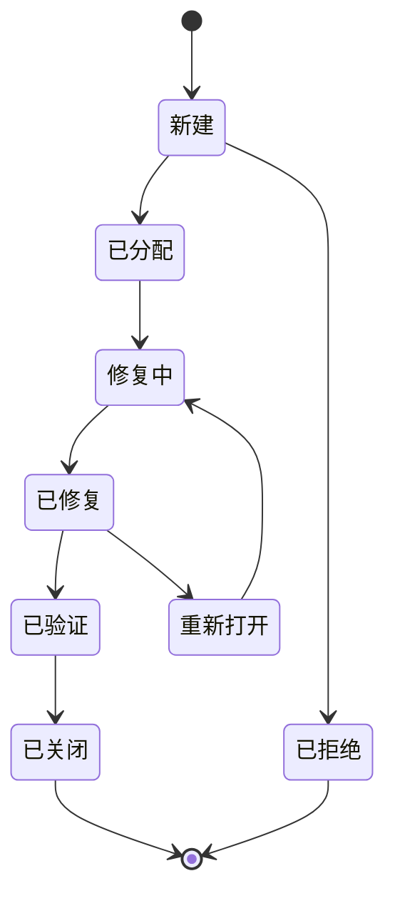
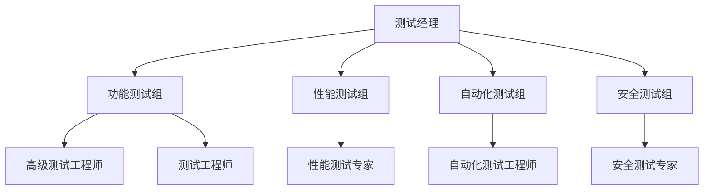

# MCP 背单词服务器 - 测试计划文档

## 1. 文档概述

本文档描述了MCP背单词服务器项目的完整测试策略、测试方法、测试用例和测试执行计划。

### 1.1 文档目的

- 确保产品质量符合需求规格
- 验证系统功能的正确性和完整性
- 评估系统性能和稳定性
- 保证用户体验达到预期标准

### 1.2 测试范围

- 功能测试
- 性能测试
- 安全测试
- 兼容性测试
- 用户体验测试
- API测试

## 2. 测试策略

### 2.1 测试金字塔



### 2.2 测试类型分布

| 测试类型 | 占比  | 执行方式     | 责任人        |
| ---- | --- | -------- | ---------- |
| 单元测试 | 60% | 自动化      | 开发工程师      |
| 集成测试 | 30% | 自动化      | 开发工程师 + QA |
| UI测试 | 10% | 手动 + 自动化 | QA工程师      |

### 2.3 测试环境策略



## 3. 测试计划

### 3.1 测试阶段规划

| 阶段     | 时间     | 测试内容     | 交付物    |
| ------ | ------ | -------- | ------ |
| 单元测试   | 开发期间   | 代码级别测试   | 单元测试报告 |
| 集成测试   | 开发完成后  | 模块间接口测试  | 集成测试报告 |
| 系统测试   | 集成测试后  | 完整系统功能测试 | 系统测试报告 |
| 性能测试   | 系统测试期间 | 性能指标验证   | 性能测试报告 |
| 安全测试   | 系统测试期间 | 安全漏洞扫描   | 安全测试报告 |
| 用户验收测试 | 系统测试后  | 业务场景验证   | UAT报告  |

### 3.2 测试里程碑



## 4. 测试用例设计

### 4.1 功能测试用例

#### TC-001: 用户注册功能测试

**测试目标**: 验证用户注册功能的正确性

| 用例ID      | 测试场景   | 前置条件  | 测试步骤                                  | 预期结果        | 优先级 |
| --------- | ------ | ----- | ------------------------------------- | ----------- | --- |
| TC-001-01 | 有效邮箱注册 | 用户未注册 | 1. 输入有效邮箱<br/>2. 输入符合要求密码<br/>3. 点击注册 | 注册成功，发送验证邮件 | 高   |
| TC-001-02 | 重复邮箱注册 | 邮箱已存在 | 1. 输入已存在邮箱<br/>2. 输入密码<br/>3. 点击注册    | 提示"邮箱已被注册"  | 高   |
| TC-001-03 | 弱密码注册  | 用户未注册 | 1. 输入有效邮箱<br/>2. 输入弱密码<br/>3. 点击注册    | 提示"密码强度不够"  | 中   |
| TC-001-04 | 邮箱格式错误 | 用户未注册 | 1. 输入错误邮箱格式<br/>2. 输入密码<br/>3. 点击注册   | 提示"邮箱格式错误"  | 中   |

#### TC-002: 用户登录功能测试

**测试目标**: 验证用户登录功能的正确性和安全性

| 用例ID      | 测试场景   | 前置条件     | 测试步骤                                | 预期结果      | 优先级 |
| --------- | ------ | -------- | ----------------------------------- | --------- | --- |
| TC-002-01 | 正确凭据登录 | 用户已注册    | 1. 输入正确邮箱<br/>2. 输入正确密码<br/>3. 点击登录 | 登录成功，跳转主页 | 高   |
| TC-002-02 | 错误密码登录 | 用户已注册    | 1. 输入正确邮箱<br/>2. 输入错误密码<br/>3. 点击登录 | 提示"密码错误"  | 高   |
| TC-002-03 | 连续错误登录 | 用户已注册    | 1. 连续3次输入错误密码                       | 账户锁定30分钟  | 高   |
| TC-002-04 | 第三方登录  | 用户已绑定第三方 | 1. 点击微信登录<br/>2. 完成授权               | 直接登录成功    | 中   |

#### TC-003: 词汇学习功能测试

**测试目标**: 验证词汇学习核心功能

| 用例ID      | 测试场景   | 前置条件    | 测试步骤                     | 预期结果       | 优先级 |
| --------- | ------ | ------- | ------------------------ | ---------- | --- |
| TC-003-01 | 开始学习会话 | 用户已选择词库 | 1. 点击开始学习<br/>2. 设置学习数量  | 进入学习界面     | 高   |
| TC-003-02 | 词汇显示   | 在学习会话中  | 1. 查看当前词汇                | 显示单词、音标、释义 | 高   |
| TC-003-03 | 发音播放   | 在学习界面   | 1. 点击发音按钮                | 播放标准发音     | 高   |
| TC-003-04 | 掌握程度标记 | 学习词汇中   | 1. 选择掌握程度<br/>2. 点击下一个   | 记录掌握状态     | 高   |
| TC-003-05 | 学习模式切换 | 在学习界面   | 1. 切换到拼写模式<br/>2. 进行拼写练习 | 模式切换成功     | 中   |

### 4.2 性能测试用例

#### TC-P001: 响应时间测试

| 用例ID       | 测试场景     | 性能指标 | 测试方法     | 验收标准    |
| ---------- | -------- | ---- | -------- | ------- |
| TC-P001-01 | 用户登录响应时间 | 响应时间 | JMeter压测 | < 2秒    |
| TC-P001-02 | 词汇加载响应时间 | 响应时间 | 自动化测试    | < 1秒    |
| TC-P001-03 | 学习记录提交   | 响应时间 | API测试    | < 500ms |
| TC-P001-04 | 推荐算法响应   | 响应时间 | 算法测试     | < 3秒    |

#### TC-P002: 并发性能测试

| 用例ID       | 测试场景   | 并发数    | 测试时长 | 验收标准    |
| ---------- | ------ | ------ | ---- | ------- |
| TC-P002-01 | 并发登录测试 | 1000用户 | 10分钟 | 成功率>99% |
| TC-P002-02 | 并发学习测试 | 500用户  | 30分钟 | 响应时间<2秒 |
| TC-P002-03 | 峰值压力测试 | 2000用户 | 5分钟  | 系统不崩溃   |

### 4.3 安全测试用例

#### TC-S001: 身份认证安全测试

| 用例ID       | 测试场景    | 测试方法      | 预期结果     |
| ---------- | ------- | --------- | -------- |
| TC-S001-01 | SQL注入测试 | 输入恶意SQL语句 | 系统拒绝并记录  |
| TC-S001-02 | XSS攻击测试 | 输入恶意脚本    | 脚本被过滤    |
| TC-S001-03 | 暴力破解测试  | 自动化密码尝试   | 账户锁定机制生效 |
| TC-S001-04 | 会话劫持测试  | 伪造会话令牌    | 访问被拒绝    |

#### TC-S002: 数据安全测试

| 用例ID       | 测试场景    | 测试方法      | 预期结果     |
| ---------- | ------- | --------- | -------- |
| TC-S002-01 | 密码存储安全  | 检查数据库密码字段 | 密码已加密存储  |
| TC-S002-02 | 数据传输加密  | 网络抓包分析    | 敏感数据已加密  |
| TC-S002-03 | API访问控制 | 未授权API调用  | 返回401错误  |
| TC-S002-04 | 个人信息保护  | 数据访问权限检查  | 只能访问自己数据 |

### 4.4 兼容性测试用例

#### TC-C001: 浏览器兼容性测试

| 用例ID       | 浏览器     | 版本  | 测试功能  | 验收标准     |
| ---------- | ------- | --- | ----- | -------- |
| TC-C001-01 | Chrome  | 最新版 | 全功能测试 | 100%功能正常 |
| TC-C001-02 | Firefox | 最新版 | 全功能测试 | 100%功能正常 |
| TC-C001-03 | Safari  | 最新版 | 全功能测试 | 100%功能正常 |
| TC-C001-04 | Edge    | 最新版 | 全功能测试 | 100%功能正常 |

#### TC-C002: 设备兼容性测试

| 用例ID       | 设备类型 | 分辨率       | 测试内容  | 验收标准   |
| ---------- | ---- | --------- | ----- | ------ |
| TC-C002-01 | 桌面端  | 1920x1080 | 界面适配  | 界面完整显示 |
| TC-C002-02 | 平板端  | 1024x768  | 触控操作  | 操作流畅   |
| TC-C002-03 | 手机端  | 375x667   | 响应式布局 | 布局自适应  |

## 5. 自动化测试策略

### 5.1 自动化测试框架



### 5.2 自动化测试工具选择

| 测试类型  | 工具        | 用途             | 优势          |
| ----- | --------- | -------------- | ----------- |
| 单元测试  | Jest      | JavaScript单元测试 | 快速、简单、内置断言  |
| API测试 | Supertest | HTTP接口测试       | 与Express集成好 |
| E2E测试 | Cypress   | 端到端测试          | 实时调试、截图录像   |
| 性能测试  | JMeter    | 负载压力测试         | 功能强大、报告详细   |
| 安全测试  | OWASP ZAP | 安全漏洞扫描         | 开源、专业       |

### 5.3 CI/CD集成



## 6. 测试数据管理

### 6.1 测试数据策略

| 数据类型 | 来源   | 管理方式  | 更新频率  |
| ---- | ---- | ----- | ----- |
| 用户数据 | 模拟生成 | 脚本自动化 | 每次测试前 |
| 词汇数据 | 真实词库 | 数据库备份 | 每周更新  |
| 学习记录 | 自动生成 | 随机算法  | 实时生成  |
| 配置数据 | 手动维护 | 版本控制  | 按需更新  |

### 6.2 测试环境数据

#### 用户测试数据

```json
{
  "testUsers": [
    {
      "email": "test1@example.com",
      "password": "Test123456",
      "level": "beginner",
      "role": "student"
    },
    {
      "email": "test2@example.com",
      "password": "Test123456",
      "level": "intermediate",
      "role": "student"
    },
    {
      "email": "teacher@example.com",
      "password": "Teacher123",
      "level": "advanced",
      "role": "teacher"
    }
  ]
}
```

#### 词汇测试数据

```json
{
  "testWords": [
    {
      "word": "hello",
      "pronunciation": "/həˈloʊ/",
      "definition": "used as a greeting",
      "example": "Hello, how are you?",
      "difficulty": 1
    },
    {
      "word": "sophisticated",
      "pronunciation": "/səˈfɪstɪkeɪtɪd/",
      "definition": "having great knowledge or experience",
      "example": "She has sophisticated taste in art.",
      "difficulty": 5
    }
  ]
}
```

## 7. 缺陷管理

### 7.1 缺陷分类

| 严重级别          | 定义         | 响应时间 | 修复时间 |
| ------------- | ---------- | ---- | ---- |
| 致命 (Critical) | 系统崩溃、数据丢失  | 1小时  | 24小时 |
| 严重 (Major)    | 核心功能无法使用   | 4小时  | 72小时 |
| 一般 (Minor)    | 功能异常但有替代方案 | 1天   | 1周   |
| 轻微 (Trivial)  | 界面问题、文字错误  | 3天   | 2周   |

### 7.2 缺陷生命周期



### 7.3 缺陷报告模板

```markdown
## 缺陷报告

**缺陷ID**: BUG-2024-001
**发现日期**: 2024-01-15
**报告人**: 张三
**严重级别**: 严重
**优先级**: 高

### 缺陷描述
用户登录时输入正确密码仍提示密码错误

### 重现步骤
1. 打开登录页面
2. 输入邮箱: test@example.com
3. 输入密码: Test123456
4. 点击登录按钮

### 预期结果
登录成功，跳转到主页

### 实际结果
提示"密码错误"，无法登录

### 环境信息
- 浏览器: Chrome 120.0
- 操作系统: Windows 11
- 测试环境: test.example.com

### 附件
- 错误截图: screenshot.png
- 日志文件: error.log
```

## 8. 测试报告

### 8.1 测试执行报告模板

#### 测试概要

- **项目名称**: MCP背单词服务器
- **测试版本**: v1.0.0
- **测试周期**: 2024-01-01 至 2024-01-31
- **测试负责人**: 李四

#### 测试统计

| 测试类型   | 计划用例数   | 执行用例数   | 通过用例数   | 失败用例数 | 通过率       |
| ------ | ------- | ------- | ------- | ----- | --------- |
| 功能测试   | 150     | 150     | 145     | 5     | 96.7%     |
| 性能测试   | 20      | 20      | 18      | 2     | 90.0%     |
| 安全测试   | 30      | 30      | 28      | 2     | 93.3%     |
| 兼容性测试  | 40      | 40      | 40      | 0     | 100%      |
| **总计** | **240** | **240** | **231** | **9** | **96.3%** |

#### 缺陷统计

| 严重级别   | 发现数量   | 修复数量   | 遗留数量  | 修复率       |
| ------ | ------ | ------ | ----- | --------- |
| 致命     | 0      | 0      | 0     | -         |
| 严重     | 3      | 3      | 0     | 100%      |
| 一般     | 6      | 5      | 1     | 83.3%     |
| 轻微     | 8      | 6      | 2     | 75.0%     |
| **总计** | **17** | **14** | **3** | **82.4%** |

#### 测试结论

- 系统核心功能基本稳定
- 性能指标基本达标
- 安全性符合要求
- 建议修复遗留缺陷后发布

### 8.2 性能测试报告

#### 响应时间测试结果

| 接口   | 平均响应时间 | 95%响应时间 | 最大响应时间 | 目标值   | 是否达标 |
| ---- | ------ | ------- | ------ | ----- | ---- |
| 用户登录 | 1.2s   | 1.8s    | 2.5s   | <2s   | ✅    |
| 词汇加载 | 0.8s   | 1.2s    | 1.5s   | <1s   | ❌    |
| 学习记录 | 0.3s   | 0.4s    | 0.6s   | <0.5s | ✅    |
| 推荐算法 | 2.1s   | 2.8s    | 3.2s   | <3s   | ❌    |

#### 并发测试结果

- **最大并发用户数**: 1200
- **系统稳定并发数**: 1000
- **平均CPU使用率**: 65%
- **平均内存使用率**: 72%
- **错误率**: 0.5%

## 9. 测试工具和环境

### 9.1 测试工具清单

| 工具名称      | 版本   | 用途    | 许可证        |
| --------- | ---- | ----- | ---------- |
| Jest      | 29.0 | 单元测试  | MIT        |
| Cypress   | 12.0 | E2E测试 | MIT        |
| JMeter    | 5.5  | 性能测试  | Apache 2.0 |
| Postman   | 10.0 | API测试 | 免费版        |
| OWASP ZAP | 2.12 | 安全测试  | Apache 2.0 |
| Selenium  | 4.0  | 自动化测试 | Apache 2.0 |

### 9.2 测试环境配置

#### 硬件配置

- **CPU**: 8核 Intel i7
- **内存**: 16GB DDR4
- **存储**: 500GB SSD
- **网络**: 1Gbps

#### 软件配置

- **操作系统**: Ubuntu 20.04 LTS
- **数据库**: PostgreSQL 14
- **缓存**: Redis 6.2
- **Web服务器**: Nginx 1.20
- **应用服务器**: Node.js 18

### 9.3 测试环境部署

```yaml
# docker-compose.test.yml
version: '3.8'
services:
  app:
    build: .
    ports:
      - "3000:3000"
    environment:
      - NODE_ENV=test
      - DB_HOST=postgres
      - REDIS_HOST=redis
    depends_on:
      - postgres
      - redis

  postgres:
    image: postgres:14
    environment:
      - POSTGRES_DB=words_test
      - POSTGRES_USER=test
      - POSTGRES_PASSWORD=test123
    ports:
      - "5432:5432"

  redis:
    image: redis:6.2
    ports:
      - "6379:6379"
```

## 10. 风险评估和应对

### 10.1 测试风险识别

| 风险类型 | 风险描述    | 影响程度 | 发生概率 | 风险等级 |
| ---- | ------- | ---- | ---- | ---- |
| 技术风险 | 测试环境不稳定 | 高    | 中    | 高    |
| 资源风险 | 测试人员不足  | 中    | 低    | 低    |
| 时间风险 | 测试时间不够  | 高    | 中    | 高    |
| 质量风险 | 需求变更频繁  | 中    | 高    | 高    |

### 10.2 风险应对策略

| 风险      | 应对策略         | 责任人  | 预期效果     |
| ------- | ------------ | ---- | -------- |
| 测试环境不稳定 | 建立备用环境，自动化部署 | 运维团队 | 降低环境问题影响 |
| 测试人员不足  | 增加自动化测试覆盖率   | QA团队 | 提高测试效率   |
| 测试时间不够  | 优先测试核心功能     | 项目经理 | 确保关键质量   |
| 需求变更频繁  | 建立变更控制流程     | 产品经理 | 减少变更影响   |

## 11. 测试团队和职责

### 11.1 团队组织结构



### 11.2 角色职责

| 角色       | 主要职责             | 技能要求        |
| -------- | ---------------- | ----------- |
| 测试经理     | 测试计划制定、团队管理、进度跟踪 | 项目管理、测试策略   |
| 功能测试工程师  | 功能测试用例设计和执行      | 测试理论、业务理解   |
| 性能测试专家   | 性能测试方案设计和执行      | JMeter、性能调优 |
| 自动化测试工程师 | 自动化脚本开发和维护       | 编程、测试框架     |
| 安全测试专家   | 安全漏洞扫描和渗透测试      | 安全知识、渗透工具   |

---

*本测试计划将根据项目进展和实际情况进行调整和完善。*